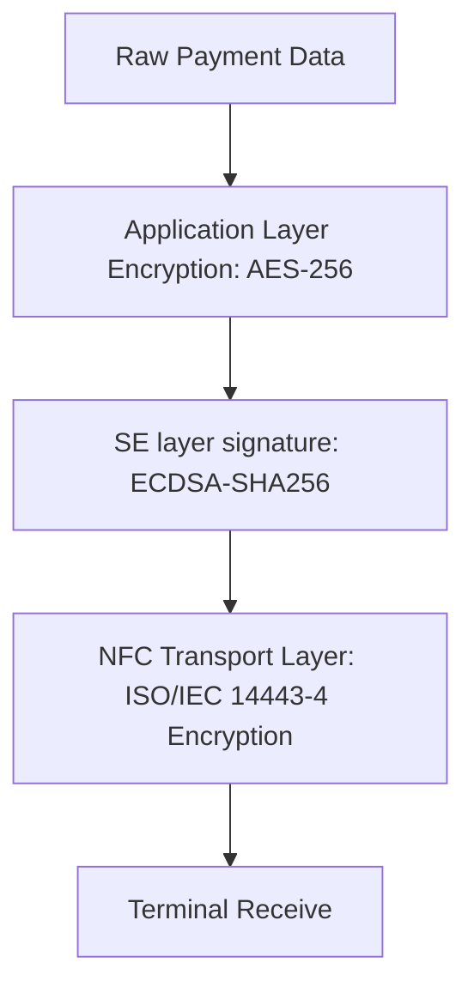

# Huawei Hongmeng Payment Security Practical Battle: Analysis of "Double Insurance" Technology of NFC and Security Units

hello!I am Xiao L, the female programmer who "builds walls and bricks" in the field of Hongmeng Payment Security~ Have you ever thought about how to prevent data from peeping when swiping a bus card on your mobile phone?When scanning the code to pay, how can the password be "invisible and intangible"?Today, let’s disassemble the “security core” of Hongmeng Payment – ​​the combination of NFC and Secure Element (security unit) to see how they make payment data “encrypted throughout the process and impeccable”!


## 1. The "golden partner" of payment security: NFC+Secure Element
### (I) NFC: "Physical Isolation Channel" for Payment
- **Natural security advantages of short-distance communication**
- Communication distance <10cm, the signal attenuates extremely fast with distance, preventing "far-field eavesdropping"
- The device acts as a "card reader" in active mode, simulates "bank card" in passive mode, and has two-way identity verification

- **"Dynamic Mask" of the Transmission Process**
- Each transaction generates a unique session key (SK) and is destroyed as soon as the transaction is finished
  ```typescript
// Generate dynamic session key (example)
  const sk = crypto.generateKey({ name: 'AES-GCM', length: 256 });
  ```

### (II) Secure Element: the "safe" of data
- **Hardware-level security isolation**
- Secure chip/software environment independent of the main system, the attack difficulty is equivalent to cracking a bank card
- Comply with international security standards such as EMVCo and GP, and pass UnionPay card simulation certification

- **"Three-layer protection" of key management**
  ```mermaid
  graph LR
A[User Key] --> B[Secure Element Generation]
B --> C [Hardware Encrypted Storage]
C --> D [Use only in a safe environment]
  ```


## 2. Core implementation: from "key generation" to "secure transmission"

### (I) Secure Element key full life cycle management
#### 1. Root key generation (device initialization phase)
```typescript
import { omapi } from '@kit.ConnectivityKit';

const seService = omapi.newSEService();
const rootKey = await seService.generateRootKey('RSA-4096'); // Generate 4096-bit RSA root key
seService.exportRootKeyToSecureStorage(rootKey); // Store in a secure storage area
```

#### 2. Application key derivation (when payment application is installed)
```typescript
const appKey = seService.deriveKeyFromRoot(
'PAYMENT_APP', // Application ID
'AES-256-GCM' // Algorithm
);
seService.installKeyToApplet(appKey, 'PaymentApplet'); // Inject payment applet
```

#### 3. Dynamic generation of transaction keys (every time payment)
```typescript
const transactionKey = seService.generateKeyForTransaction(
'AES-256-CTR', // Counter mode prevents playback attack
    { 
validity: 300, // The key is valid for 5 minutes
        usage: ['encrypt', 'decrypt']
    }
);
```

### (II) Construction of "encrypted tunnel" for NFC payment
#### 1. Card simulation mode initialization (HCE)
```typescript
import { cardEmulation } from '@kit.ConnectivityKit';

const hceService = new cardEmulation.HceService();
hceService.registerForApduCommands((apdu) => {
// After receiving the terminal command, call the SE encryption response
    const encryptedData = seService.encryptWithTransactionKey(apdu.data);
    return encryptedData;
});
hceService.enableForegroundDispatch(aidList); // The front desk will prioritize payment requests
```

#### 2. "Triple Encryption" of Data Transmission


#### 3. Secure session process (taking bus payment as an example)
```typescript
// Mobile phone (card simulation mode)
async function processBusPayment(amount: number) {
// 1. Generate transaction data
    const data = {
        cmd: 'PAYMENT',
        amount: amount,
        timestamp: Date.now(),
        deviceId: await getDeviceId()
    };
    
// 2. SE encrypted data
    const encryptedData = await seService.encrypt(
        JSON.stringify(data), 
        transactionKey
    );
    
// 3. NFC sends APDU command
    const apdu = new ApduCommand(0x00, 0xA4, 0x04, 0x00, encryptedData);
    hceService.sendCommand(apdu);
    
// 4. Wait for terminal response (decryption via SE)
    const response = await hceService.waitForResponse();
    const decryptedResponse = seService.decrypt(response.data, transactionKey);
    return decryptedResponse;
}
```


## 3. Security reinforcement: Practical strategies to resist "payment attacks"

### (I) Anti-playback attack: timestamp + counter
```typescript
// Append a timestamp and a counter when sending data
const payload = {
    ...data,
nonce: seService.generateNonce(), // Random numbers prevent replay
    timestamp: Date.now(),
counter: seService.incrementCounter() // +1 per transaction
};

// Terminal verification logic (example)
if (payload.timestamp < (Date.now() - 60*1000)) {
throw new Error('Transaction timeout');
}
if (payload.counter <= lastCounter) {
throw new Error('Repeat transaction');
}
lastCounter = payload.counter;
```

### (II) Anti-side channel attack: electromagnetic shielding + power consumption equalization
- **Hardware level**:
Secure Element chip has built-in electromagnetic shielding layer to prevent decryption of keys through power consumption analysis (DPA)

- **Software Level**:
  ```typescript
// Insert random empty operation during encryption to confuse the power consumption curve
  function secureEncrypt(data: Buffer) {
const randomOps = new Uint8Array(Math.floor(Math.random()*100)); // 0-100 Random empty operation
      crypto.randomFillSync(randomOps);
      return seService.encrypt(data);
  }
  ```

### (III) Key leakage protection: Zero knowledge proof
```typescript
// Payment terminal verifies the user balance (no need to expose the actual balance)
async function verifyBalance(amount: number) {
// Mobile: Prove the balance ≥amount, and do not disclose the specific value
    const proof = await seService.generateZeroKnowledgeProof(amount);
return terminal verification (proof);
}
```


## 4. Practical case: Disassembly of the security process of "pay as soon as you touch"

### Scenario: Convenience store shopping, mobile NFC pays 58 yuan
#### Step 1: The device is close to the terminal and triggers the NFC card simulation
```typescript
hceService.on('apduReceived', (apdu) => {
if (apdu.ins === 0xA2) { // Terminal request payment
Process payment (apdu.data);
    }
});
```

#### Step 2: SE generates transaction key and encrypts data
```typescript
async function to process payment (terminal data: Buffer) {
// 1. Analyze terminal data (such as terminal ID, transaction type)
const { terminalId, txnType } = parseTerminalData(terminal data);
    
// 2. Generate transaction key (valid for 300 seconds)
    const txnKey = await seService.createTransientKey({
        keyType: 'AES-256',
        validity: 300,
        usage: ['encrypt', 'sign']
    });
    
// 3. Build payment data (including amount, time, device fingerprint)
    const paymentData = {
        amount: 58.00,
        timestamp: Date.now(),
        deviceFingerprint: await getDeviceFingerprint(),
        terminalId: terminalId,
        txnType: txnType
    };
    
// 4. Triple encryption: SE encryption + digital signature + MAC verification
    const encryptedData = await seService.encryptAndSign(
        paymentData, 
        txnKey, 
rootKey // Use the root key to perform secondary verification of the signature
    );
    
    return encryptedData;
}
```

#### Step 3: NFC transmits encrypted data, terminal decryption verification
```typescript
// After the terminal receives the data:
1. Verify the signature with UnionPay public key (root key derived)
2. Decrypt payment data with session key
3. Verify timestamp (±5 minutes) and device fingerprint
4. 调用银行接口完成扣款
```

#### Security indicators:
- The time to generate the key to transfer: **<80ms**
- Data encryption strength: **AES-256+ECDSA-384**
- Anti-brute force cracking ability: **10^30 attempts/second, 10^60 years to crack**


## 5. Pit avoidance guide: "Train investigation" for payment security

### (I) NFC connection failed
- **Reason 1**: Background application seizes NFC resources
- *Solution*: Call `hceService.enable()` in `onForeground` to ensure the foreground priority

- **Reason 2**: AID matching failed
- *solve*:
    ```typescript
// Register the correct AID (must be consistent with the bank backend)
    const aidList = ['A0000000041010', 'A0000000031010'];
    hceService.registerAids(aidList);
    ```

### (II) Secure Element operation timeout
- **Reason**: SE chip processing queue is blocked (such as processing multiple payment requests at the same time)
- *solve*:
    ```typescript
// Use queue to manage SE operations to avoid concurrency
    const seQueue = new Queue<() => Promise<void>>();
    function enqueueSEOperation(op: () => Promise<void>) {
        seQueue.enqueue(op);
        if (seQueue.length === 1) {
            processQueue();
        }
    }
    async function processQueue() {
        while (seQueue.length > 0) {
            const op = seQueue.dequeue();
            await op();
        }
    }
    ```

### (III) Confused key management
- **Best Practice**:
- Adopt the "one application, one key" strategy, and different payment applications use independent keys
- Regularly rotate keys (such as automatic updates per week)
  ```typescript
// Automatically update the application key every morning on Sunday
  if (isSunday(now) && hour(now) === 2) {
      const newKey = seService.generateKey('AES-256');
      seService.updateKey('PaymentApplet', newKey);
  }
  ```


## Last chat
The combination of NFC and Secure Element is like putting a "double lock" on payment data - NFC uses physical distance to isolate risks, and Secure Element uses hardware encryption to protect the core.The underlying logic of Hongmeng Payment Security is to integrate "security" into the flow of every byte: from "hardware isolation" when key generation, to "dynamic encryption" in transmission, to "zero knowledge proof" during verification, each link answers a question: **How ​​can users enjoy convenience while data is safer than put in their wallet?**

In the future, with the expansion of Hongmeng ecosystem, this security mechanism will also be extended to scenarios such as smart car payment and smart home payment.Next time, let’s talk about “how to use Hongmeng’s Trusted Execution Environment (TEE) to achieve “hardware-level protection of fingerprint payment” – remember to follow!😉

(Please indicate the source and original author Xiao L when reprinting. Violators... Let your payment prompt "safety verification failed" every time! Just kidding~)
