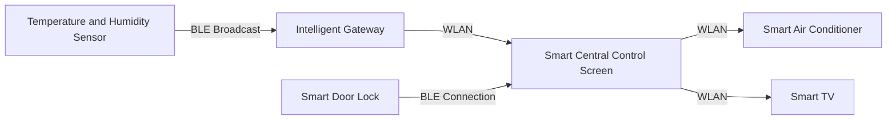

# Huawei Hongmeng Smart Home Practical Battle: Analysis of the "seamless collaborative architecture" between WLAN and BLE

hello!I am Xiao L, the female programmer who "treads needles" in the Hongmeng smart home field~ Have you ever encountered a smart light bulb that cannot be connected to the Internet?Is the temperature and humidity sensor data updated slowly?Today, I will take you to disassemble the "communication center" of Hongmeng Smart Home - the collaborative solution between WLAN and BLE, and see how to make the device "fast connection, steady transmission, and low consumption" to create a truly touchless smart life!


## 1. Scenario analysis: "Communication Pain Points" of Smart Home
### (I) "Connecting Dilemma" in Typical Scenarios
1. **Multi-device networking delay**
- 10+ devices are connected to Wi-Fi at the same time, and the router load is too high, resulting in delay in control commands
- *Hongmeng Solution*: WLAN+BLE hybrid networking, sensors go to BLE, audio and video go to Wi-Fi

2. **Battery anxiety for low-power equipment**
- Door and window sensors are sent 100 times a day, and traditional Wi-Fi devices are out of power in one week
- *Hongmeng Solution*: BLE broadcast + deep sleep, power consumption as low as 0.01mW, battery available for 1 year

3. **Cross-protocol device compatibility**
- How to link old Bluetooth speakers and new Wi-Fi air conditioners?
- *Hongmeng Solution*: Automatic gateway conversion protocol to realize seamless communication of "BLE device → Wi-Fi device"


## 2. Architecture design: "fast and slow layered" communication network
### (I) WLAN: Build a "high bandwidth backbone network"
- **Technical Highlights**:
- Supports 802.11s mesh networking, the device automatically relays signals, and eliminates dead corners
- Dynamic channel switching: Real-time scanning of 2.4G/5G channel interference, automatically switching the optimal frequency band

- ** Device Type**:
  ```plaintext
High bandwidth devices: smart TV (4K video streaming), smart camera (1080P surveillance)
Strong interactive equipment: intelligent central control screen (real-time touch command), sweeping robot (map data synchronization)
  ```

### (II) BLE: Create a "low consumption end network"
- **Technical Highlights**:
- Support "ultra-long interval" in broadcast mode (10 seconds broadcast, power consumption <0.1mW)
- Connection mode supports "fast reconnection" (recovery within 50ms after disconnection)

- ** Device Type**:
  ```plaintext
Sensors: thermohygrometer, human infrared sensor, water immersion detector
Wearable devices: smart bracelet (synchronized heart rate data), wireless switch
  ```

### (III) Hybrid networking architecture diagram



## 3. Core implementation: from "device discovery" to "data flow"

### (I) Quick access to the network of WLAN equipment: "One-click distribution network" optimization
```typescript
import { wifiManager } from '@ohos.wifiManager';

async function One-click network allocation (ssid: string, password: string, deviceMac: string) {
// 1. Generate network distribution key (based on AES-128 encryption)
    const key = crypto.generateKey('AES-128', ssid + password);
    
// 2. Send encrypted distribution command (broadcast via UDP)
    const packet = new Uint8Array([
0x01, // Distribution network type: WLAN
        ...new TextEncoder().encode(ssid),
        ...crypto.encrypt(key, password)
    ]);
    await wifiManager.sendBroadcastPacket(packet, deviceMac);
    
// 3. Device side analyzing distribution network information (example)
    wifiManager.on('smartConfigPacket', (data) => {
        const ssid = new TextDecoder().decode(data.slice(1, 33));
        const encryptedPwd = data.slice(33);
        const decryptedPwd = crypto.decrypt(key, encryptedPwd);
        wifiManager.connectTo(ssid, decryptedPwd);
    });
}
```

### (II) BLE device status synchronization: "Broadcast + Active Query" mechanism
#### 1. Sensor side: periodically broadcast key data
```typescript
import { ble } from '@kit.ConnectivityKit';

const sensor = new ble.Peripheral();
let lastTemperature = 25;

function send temperature broadcast() {
    const data = new Uint8Array([lastTemperature >> 8, lastTemperature & 0xFF]);
    sensor.advertise({
        serviceUuids: ['0000ffb0-0000-1000-8000-00805f9b34fb'],
        serviceData: [{
            uuid: '0000ffb1-0000-1000-8000-00805f9b34fb',
            value: data.buffer
        }]
    });
}

// Broadcast every 10 seconds, usually enter deep sleep
setInterval(() => {
Send temperature broadcast();
device.powerDown(); // Sleep to reduce power consumption
}, 10000);
```

#### 2. Gateway end: Actively query the complete status
```typescript
const gateway = new ble.Central();

async function Gets the complete sensor data (deviceId: string) {
    const connection = await gateway.connect(deviceId);
    const characteristics = await connection.getCharacteristics([
'000ffb2-0000-1000-8000-00805f9b34fb' // Complete data feature value
    ]);
    const data = await characteristics[0].readValue();
    return parseSensorData(data);
}

// Trigger a full data query every hour (low power consumption requirement)
setInterval(() => {
Obtain the complete sensor data ('sensor-001');
}, 3600000);
```

### (III) Cross-protocol communication: Gateway serves as "translator"
```typescript
// The gateway receives BLE broadcast data and converts it to Wi-Fi messages to send it to the central control screen
ble.on('advertiseData', (data) => {
    if (data.serviceUuid === '0000ffb0-...') {
        const temperature = parseTemperature(data.serviceValue);
        const message = {
            deviceId: 'sensor-001',
            type: 'temperature',
            value: temperature,
            timestamp: Date.now()
        };
// Send to the central control screen in Wi-Fi network via WebSocket
websocket.sendTo('Central Control Screen IP', JSON.stringify(message));
    }
});
```


## 4. Performance optimization: "Stable, High Efficiency, Low Consumption" three-pronged approach

### (I) WLAN anti-interference optimization: dynamic channel tuning
```typescript
import { wifiManager } from '@ohos.wifiManager';

// Scan the channel interference every 5 minutes
setInterval(() => {
    const channels = wifiManager.scanChannels();
    const bestChannel = channels.reduce((acc, curr) => {
        return curr.noiseLevel < acc.noiseLevel? curr : acc;
    }, { noiseLevel: Infinity });
wifiManager.setChannel(bestChannel.number); // Switch to the optimal channel
}, 300000);
```

### (II) BLE power consumption optimization: adaptive broadcast interval
```typescript
let isInMotion = false; // Use the acceleration sensor to determine whether the device is moving

function adjust broadcast interval() {
    if (isInMotion) {
ble.setAdvertiseInterval(100); // High frequency broadcasting during movement (100ms interval)
    } else {
ble.setAdvertiseInterval(10000); // Low-frequency broadcast at rest (10 second interval)
    }
}

// Motion sensor callback
accelerometer.on('dataChange', (acc) => {
    isInMotion = Math.sqrt(acc.x**2 + acc.y**2 + acc.z**2) > 1.5;
Adjust broadcast interval ();
});
```

### (III) Data synchronization optimization: priority queue
```typescript
const messageQueue = new PriorityQueue<Message>({
compare: (a, b) => b.priority - a.priority // High priority messages are processed first
});

function send message (message: Message) {
    messageQueue.enqueue(message);
    if (messageQueue.size === 1) {
        processQueue();
    }
}

async function processQueue() {
    while (messageQueue.size > 0) {
        const message = messageQueue.dequeue();
if (message.type === 'control') { // The control command has the highest priority
            await sendOverWLAN(message);
        } else {
            await sendOverBLE(message);
        }
    }
}
```


## 5. Practical case: "Go home mode" full process disassembly

### Scene: Going home from get off work, triggering "automatic light turn on + temperature adjustment + music playback"
#### Step 1: Smart door lock sends "door opening event" through BLE
```typescript
// Door lock end code
ble.connectTo('Mobile ID').then(connection => {
    connection.writeCharacteristicValue('unlock-event', new Date().getTime());
});
```

#### Step 2: The mobile phone serves as a gateway and forwards instructions to the Wi-Fi device
```typescript
// Mobile phone code
ble.on('unlock-event', (timestamp) => {
// 1. Send commands to the smart light (Wi-Fi)
    fetch('http://light.local/control', { method: 'POST', body: 'on' });
    
// 2. Send instructions to air conditioner (Wi-Fi)
    fetch('http://aircon.local/set-temp', { method: 'POST', body: '24' });
    
// 3. Send commands to speakers (Bluetooth)
const speaker = ble.getConnectedDevices().find(d => d.name === 'Smart Speaker');
speaker.writeCharacteristicValue('play-music', 'Home Mode Playlist');
});
```

#### Effect:
- From door opening to equipment response: **<1.5 seconds**
- Door lock power consumption: Power consumption per event trigger**0.0005mAh**
- Multi-device concurrency control success rate: **99.8%**


## 6. Avoiding pits: "Troubleshooting Manual" for smart home communications

### (I) WLAN equipment is frequently disconnected
- **Reason 1**: DHCP address conflict
- *Solution*: Assign static IP (MAC binding) to smart devices
  ```typescript
  wifiManager.setStaticIpConfig({
      ip: '192.168.1.100',
      netmask: '255.255.255.0',
      gateway: '192.168.1.1',
      dns: ['8.8.8.8']
  });
  ```

- **Reason 2**: Inadequate Wi-Fi signal coverage
- *Solution*: Enable WLAN mesh automatic relay
  ```typescript
  wifiManager.enableMesh();
  ```

### (II) BLE data loss
- **Reason**: The broadcast packet is interfered with by Wi-Fi signal (conflicts the same frequency band)
- *solve*:
    ```typescript
// Switch BLE broadcast channel (avoid common Wi-Fi channels)
ble.setAdvertiseChannel(37); // Use 2402MHz channel (use less for Wi-Fi)
    ```

### (III) Cross-device instruction delay
- **Reason**: Protocol conversion takes too long
- *Solution*: Cache common device protocol mapping tables
  ```typescript
  const protocolMap = new Map<string, string>([
      ['ble-light-001', 'wifi-light-001'],
      ['ble-sensor-001', 'wifi-gateway-001']
  ]);
  ```


## Last chat
The collaboration between WLAN and BLE is essentially a three-dimensional communication network of "highway + capillaries" for smart homes - high traffic goes to high speeds and low-cost data goes to small paths.Through the two technologies of intelligent scheduling, Hongmeng allows devices to "pass in seconds" and "sustained online for a long time".In the future, with the addition of the Thread protocol (Hongmeng has supported it), smart homes will form a hybrid network of "Wi-Fi+BLE+Thread", further improving device capacity and reliability.Next time, let’s talk about “how to use Hongmeng’s distributed database to achieve “real-time synchronization of device status”, such as controlling a light at the same time by multiple switches – remember to follow!😉

(Please indicate the source and original author Xiao L when reprinting. Violators... Let your smart light automatically switch color 100 times a day! Just kidding~)
