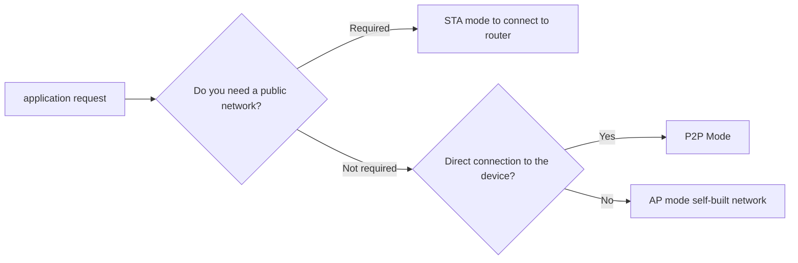

# Huawei Hongmeng WLAN full mode development practice: "Scenario-based solutions" from networking to direct connection

hello!I am Xiao L, the female programmer who "plays multi-mode" in the Hongmeng WLAN field~ Have you ever thought that a mobile phone can connect to Wi-Fi Internet access (STA), turn on hot spots to tablets (APs), and directly connect to TV screen projection (P2P)?Today, let’s disassemble the “multi-mode collaboration secret” of Hongmeng WLAN, and teach you to flexibly switch modes according to different scenarios, so that the device can “connect when it should be connected, and directly when it should be connected”!


## 1. Mode quick look: WLAN's "Trinity" capability
### (I) Mode Characteristic Comparison Table
| Mode | Role | Typical Scenarios | Bandwidth | Delay | Power Consumption |
|--------|---------------|-----------------------------------|--------|--------|--------|
| STA | Client | Mobile phone and home Wi-Fi video flashing | High | Low | Medium |
| AP | Hot host | Mobile phone hot spots for tablet temporary internet access | Medium | Medium | High |
| P2P | Direct connection device (GO/GC) | Direct connection to TV screen projection, file fast transmission | High | Extremely low | Medium |

### (II) Mode switching logic diagram



## 2. P2P mode deep optimization: full-link acceleration from "connection" to "transmission"
### (I) Quick discovery: "Multi-channel scanning" improves device search efficiency
```typescript
import { wifiManager } from '@ohos.wifiManager';

// Scan the 2.4G and 5G channels simultaneously (default only scans 2.4G)
const scanParams = {
channels: [1, 6, 11, 36, 40, 44, 48] // 2.4G+5G commonly used channels
};
wifiManager.searchP2pDevices(scanParams).then(devices => {
// Priority connection to 5G devices (faster transmission)
    const device5G = devices.find(d => d.band === '5GHz');
    if (device5G) connectP2pDevice(device5G.id);
});
```

### (II) Intelligent connection building: Automatically select GO/GC role
```typescript
// Equipment capability assessment (deciding whether to serve as GO)
function shouldBeGroupOwner(): boolean {
const isHighPerf = device.cpuCore >= 4 && device.memory >= 8*1024; // High-performance device is GO
const isBatteryLow = battery.level < 20; // Improper GO for low battery
    return isHighPerf &&!isBatteryLow;
}

// Specify the role when connecting (example: mobile phone is GC, TV is GO)
wifiManager.connectP2pDevice(targetId, {
isGroupOwner: shouldBeGroupOwner() // Automatically determine whether it is GO
}).then(() => {
    if (isGroupOwner) {
startP2pServer(); // Start server listening
    } else {
startP2pClient(); // Start client connection
    }
});
```

### (III) High-speed transmission: TCP/UDP adaptive selection
```typescript
// Select the transmission protocol according to the data type
function getP2pSocket(protocol: 'tcp' | 'udp') {
    return wifiManager.getP2pSocket({
        protocol: protocol,
tcpMss: 1460, // TCP maximum segment size (optimized transmission efficiency)
udpBuffer: 65535 // UDP buffer size
    });
}

// When the error rate of large file transfer is high, it will automatically switch from UDP to TCP
let socket = getP2pSocket('udp');
socket.on('error', (err) => {
if (err.code === 'ENOENT') { // Transmission error
        socket.close();
socket = getP2pSocket('tcp'); // Switch protocol reconnection
    }
});
```


## 3. AP mode practical combat: "Weak network environment" emergency networking plan
### (I) High-density terminal support: Optimize the number of AP connections
```typescript
// Turn on 802.11n mode to support more device connections (default 802.11g)
wifiManager.startAp({
    ssid: 'MyHarmonyAP',
    password: '12345678',
mode: wifiManager.WifiMode.MODE_802_11N, // 802.11n protocol
channel: 6, // Fixed channel to reduce interference
maxStaNum: 10 // Supports up to 10 device connections
}).then(() => {
console.log('AP is started, the device can be connected');
});
```

### (II) Traffic speed limit: Ensure key business
```typescript
// Set up up and down speed limits for different devices (unit: Kbps)
const deviceRate = {
'device1-mac': { upload: 1024, download: 4096 }, // Tablet speed limit
'device2-mac': { upload: 512, download: 2048 } // Mobile phone speed limit
};
wifiManager.setApBandwidth(deviceRate).then(() => {
console.log('Flow speed limit setting is completed');
});
```

### (III) Coexist with STA: "Relay Mode" expands network coverage
```typescript
// The mobile phone connects the main route (STA) and enables the AP (for other devices to connect)
wifiManager.enableStaAndApConcurrently(true).then(() => {
// Configure STA connection
    wifiManager.connectTo('MainRouter', 'password');
    
// Configure AP hotspots
    wifiManager.startAp({ ssid: 'RelayAP' });
    
// Data forwarding: AP device traffic is forwarded through STA routing
    wifiManager.setApForwarding(true);
});
```


## 4. STA mode advanced: "enterprise-level" network adaptation solution
### (I) 802.1X certification: enterprise network security access
```typescript
import { wifiManager } from '@ohos.wifiManager';

const eapConfig = {
eapMethod: wifiManager.EapMethod.EAP_TLS, // TLS authentication
caCert: fs.readFileSync('ca.crt'), // CA certificate
clientCert: fs.readFileSync('client.p12'), // Client certificate
    privateKey: 'privateKeyPassword'
};
wifiManager.connectTo('EnterpriseWiFi', {
    securityParam: {
        securityType: wifiManager.SecurityType.SECURITY_EAP,
        eapConfig: eapConfig
    }
});
```

### (II) Seamless roaming: Cross-AP switching optimization
```typescript
// Monitor the signal strength, automatically switch the AP below the threshold
wifiManager.on('signalStrengthChanged', (strength) => {
if (strength < -70) { // Switching is triggered when the signal is below -70dBm
        const nearbyAps = wifiManager.scanAps();
        const bestAp = nearbyAps.sort((a, b) => b.rssi - a.rssi)[0];
        wifiManager.connectTo(bestAp.ssid);
    }
});
```

### (III) IPv6 support: future network adaptation
```typescript
// Enable IPv6 DHCPv6 to get the address
wifiManager.setIPv6Enabled(true).then(() => {
    const ip6Addr = wifiManager.getIPv6Address();
console.log('IPv6 address:', ip6Addr);
});

// IPv6 communication example (UDP)
const socket = new dgram.Socket('udp6');
socket.bind(8888);
socket.send('hello', 8888, 'fe80::1%wlan0');
```


## 5. Multi-mode collaboration: a typical scenario of "hybrid networking"
### Scene: Outdoor Live Broadcast - Mobile STA Hot Spot + P2P Video Streaming
#### Step 1: Connect live hot spots in STA mode on your mobile phone
```typescript
wifiManager.connectTo('LiveHotspot', 'livepassword');
```

#### Step 2: The camera directly connects to the mobile phone to transmit video stream
```typescript
// The mobile phone starts P2P service as GO
wifiManager.startP2pAsGroupOwner().then(() => {
    const server = net.createServer('tcp');
    server.on('connection', (socket) => {
socket.pipe(httpServer.createWriteStream('live.mp4')); // Write to live file
    });
    server.listen(8080);
});

// The camera is used as a GC to connect to the phone and send data
const cameraSocket = await wifiManager.getP2pSocket('tcp');
cameraSocket.connect('192.168.43.1', 8080);
camera.captureStream().pipe(cameraSocket);
```

#### Advantages:
- Live streaming traffic goes to STA public network and uploads stably
- Direct video transmission between camera and mobile phone, delay <50ms
- No additional router required, quickly build a live broadcast system


## 6. Pit avoidance guide: "Train Check" for Mode Switching
### (I) P2P connection failed
- **Reason 1**: The device does not support 5G band
- *Solution*: Forced use of 2.4G band
  ```typescript
  wifiManager.connectP2pDevice(targetId, { band: '2.4GHz' });
  ```

- **Reason 2**: Firewall blocks ports
- *Solution*: Open P2P default port (TCP:5357, UDP:3702)
  ```typescript
  firewall.addRule('allow', 'p2p', ['tcp:5357', 'udp:3702']);
  ```

### (II) AP mode hotspots are not visible
- **Reason**: AP name (SSID) contains special characters
- *Solution*: Use pure English + digital SSID
  ```typescript
const ssid = 'HarmonyAP_' + Math.random().toString(36).substr(2, 8); // Generate compliant SSID
  ```

### (III) Failed to obtain IP in STA mode
- **Reason**: DHCP server failure
- *Solution*: Manually set static IP
  ```typescript
  wifiManager.setStaticIp('192.168.1.100', '255.255.255.0', '192.168.1.1', ['8.8.8.8']);
  ```


## Last chat
The multi-mode of WLAN is like the "Swiss Army Knife" - STA is the basic "blade" to solve daily networking needs; AP is the "screwdriver", which builds its own hot spots when there is no network; P2P is the "scissors", which realizes fast direct connection of devices.Through a unified API interface, Hongmeng allows developers to easily switch between different modes, and even run multiple modes at the same time (such as STA+AP coexistence).In the future, with the popularity of Wi-Fi 6/7, Hongmeng will also support more new features (such as MLO multi-link aggregation), allowing devices to always maintain the best connection status in complex network environments.Next time, let’s talk about “how to use Hongmeng’s WLAN Direct to achieve “direct connection of cross-brand devices”, such as Huawei’s mobile phones to Xiaomi TV – remember to follow!😉

(Please indicate the source and original author Xiao L when reprinting. Violators... Let your device stumble for 3 seconds every time you switch to WLAN mode! Just kidding~)
