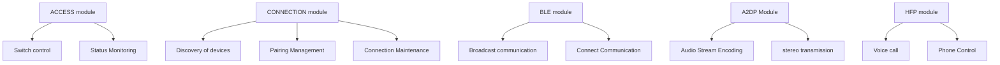

# Huawei Hongmeng Bluetooth development practice: "Full-link guide" for connecting from basics to scenario-based applications

hello!I am Xiao L, the female programmer who "treads a needle" in the Hongmeng Bluetooth field~ Have you ever encountered problems such as Bluetooth speaker disconnection and slow bracelet data synchronization?Today, we will take you into the "core engine" of Hongmeng Bluetooth, from the "precision scanning" discovered by device to the "low consumption optimization" of BLE communication, and then to the "lossless sound quality" of audio transmission, unlocking the full-scene solution developed by Bluetooth!


## 1. Bluetooth architecture analysis: the underlying logic of "modular design"
### (I) Core module division diagram


### (II) Highlights of protocol stack optimization
- **Fast Scan**:
Scan BLE and classic Bluetooth devices simultaneously, and the time takes less from 12 seconds to 4 seconds
  ```typescript
  bluetooth.startDiscovery({
mode: bluetooth.ScanMode.BALANCED // Balanced mode takes into account both speed and power consumption
  });
  ```

- **Smart Pairing**:
Support NFC touch pairing without entering PIN code
  ```typescript
bluetooth.enableNfcPairing(); // Enable NFC auxiliary pairing
  ```


## 2. Equipment discovery and connection: "0.5 seconds fast response" solution
### (I) Filter scanning: precisely locate the target equipment
```typescript
// Filter by device name (for example, only devices with the name "Headphones" are scanned)
const filter = {
    deviceName: 'Headphones'
};
bluetooth.startDiscovery({ filters: [filter] }).then(() => {
    bluetooth.on('deviceFound', (device) => {
if (device.rssi > -60) { // Signal strength > -60dBm triggers
            connectDevice(device.id);
        }
    });
});
```

### (II) Breakpoint continuous connection: automatic reconnection mechanism after disconnection
```typescript
let isConnected = false;
bluetooth.on('connectionStateChanged', (state) => {
    if (state === bluetooth.ConnectionState.DISCONNECTED) {
        if (!isConnected) return;
console.log('Disconnect, try to reconnect...');
        bluetooth.connectDevice(deviceId).then(() => {
console.log('Reconnection successful');
        }).catch(() => {
// Re-sent failed handling multiple times
        });
    } else if (state === bluetooth.ConnectionState.CONNECTED) {
        isConnected = true;
    }
});
```

### (III) Permission optimization: Dynamic application to improve connection success rate
```typescript
// Check and apply for Bluetooth permissions
if (!featureAbility.hasPermission('ohos.permission.BLUETOOTH')) {
    featureAbility.requestPermissionsFromUser(['ohos.permission.BLUETOOTH'], (err, data) => {
        if (data[0].granted) {
            startDiscovery();
        }
    });
}
```


## 3. BLE development practice: "Low power consumption + high reliability" communication model
### (I) Broadcast optimization: ultra-long intervals to reduce power consumption
```typescript
// The sensor broadcasts every 30 minutes (power consumption <0.001mW)
const advParams = {
interval: 1800000, // 30 minute interval (unit: milliseconds)
txPower: bluetooth.TxPower.LOW, // Low transmit power
connectable: false // Only broadcast, not support connection
};
ble.startAdvertising(advParams);
```

### (II) Connection optimization: Periodic data transmission
```typescript
// After establishing a connection, obtain heart rate data every 5 seconds
const connection = await ble.connect(deviceId);
const characteristic = await connection.getCharacteristic(heartRateUuid);
setInterval(() => {
    characteristic.readValue().then((data) => {
const heartRate = data.getUint8(1); // parse the heart rate value
        updateUI(heartRate);
    });
}, 5000);
```

### (III) Secure transmission: Encrypted features to protect data
```typescript
// Enable secure connection (MITM protection to prevent man-in-the-middle attacks)
const securityParams = {
securityLevel: bluetooth.SecurityLevel.SECURITY_LEVEL_4, // The highest security level
encryptionKeySize: 128 // 128-bit encryption key
};
await connection.setSecurityParam(securityParams);
```


## 4. Audio transmission optimization: "Lossless sound quality + low latency" solution
### (I) A2DP high-definition audio streaming
```typescript
// Enable A2DP high-definition encoding (SBC/AAC/aptX adaptation)
const audioConfig = {
codec: bluetooth.A2dpCodec.APTX_ADAPTIVE, // aptX adaptive encoding
sampleRate: bluetooth.SampleRate.SAMPLE_RATE_48KHZ, // 48kHz sampling rate
bitRate: bluetooth.BitRate.BITRATE_576KBPS // 576kbps bitrate
};
a2dp.setAudioConfig(audioConfig);
```

### (II) HFP voice call optimization
```typescript
// Noise reduction processing + echo cancellation
hfp.enableNoiseCancellation(true);
hfp.enableEchoCancellation(true);

// Call priority setting (higher than music playback)
hfp.setPriority(bluetooth.Priority.HIGH);
```

### (III) Multi-audio stream management
```typescript
// Connect the headset (A2DP) and the vehicle (HFP) at the same time
const devices = await bluetooth.getConnectedDevices();
const headphone = devices.find(d => d.type === bluetooth.DeviceType.AUDIO);
const carKit = devices.find(d => d.type === bluetooth.DeviceType.HANDSFREE);

// Routing control: music takes headphones, calls takes on cars
a2dp.routeTo(headphone.id);
hfp.routeTo(carKit.id);
```


## 5. Practical case: "Smart Bracelet" full-function development process
### Scenario: Bracelet communicates with mobile phone Bluetooth (data synchronization + control command)
#### Step 1: Device Discovery and Pairing
```typescript
// Scan the bracelet (filtered by manufacturer ID)
bluetooth.startDiscovery({
manufacturerData: [0x004C] // Apple manufacturer ID (example)
}).then(() => {
    bluetooth.on('deviceFound', (device) => {
        if (device.manufacturerData?.startsWith('004C')) {
            bluetooth.pairDevice(device.id, {
pinCode: '0000' // Fixed PIN code pairing
            });
        }
    });
});
```

#### Step 2: BLE data channel establishment
```typescript
// Get battery service after connection
const connection = await ble.connect(deviceId);
const batteryService = await connection.getService(
    bluetooth.Uuid.BATTERY_SERVICE
);
const batteryLevelChar = await batteryService.getCharacteristic(
    bluetooth.Uuid.BATTERY_LEVEL
);

// Monitor battery power changes
batteryLevelChar.on('valueChanged', (data) => {
    const level = data.getUint8(0);
    showBatteryLevel(level);
});
```

#### Step 3: Control command sending (such as setting an alarm clock)
```typescript
const alarmService = await connection.getService(
'000ffb0-0000-1000-8000-00805f9b34fb' // Custom Service UUID
);
const alarmChar = await alarmService.getCharacteristic(
'0000ffb1-0000-1000-8000-00805f9b34fb' // Custom Feature UUID
);

// Send the alarm setting command (0x01 means adding an alarm, time is 8:00)
const data = new Uint8Array([0x01, 0x08, 0x00]);
await alarmChar.writeValue(data);
```


## 6. Performance optimization: Key strategies for "stable, efficient, and low consumption"
### (I) Power consumption optimization: deep sleep and wake-up
```typescript
// When the BLE device has no data, it enters deep sleep (current <1uA)
ble.setPowerMode(bluetooth.PowerMode.DEEP_SLEEP);

// Set wake-up interval on the mobile phone (watch synchronous data once an hour)
setInterval(() => {
    ble.wakeUpDevice(deviceId);
    syncData();
}, 3600000);
```

### (II) Transmission optimization: Batch data merge and send
```typescript
// Combine 10 sensor data and send it in one go
let dataBuffer = new Uint8Array();
let count = 0;

function addToBuffer(data) {
    dataBuffer = Uint8Array.concat(dataBuffer, data);
    count++;
    if (count >= 10) {
        sendBatchData(dataBuffer);
        dataBuffer = new Uint8Array();
        count = 0;
    }
}

async function sendBatchData(data) {
    await characteristic.writeValue(data, {
withoutResponse: true // Non-response mode to increase speed
    });
}
```

### (III) Compatibility optimization: protocol version adaptation
```typescript
// Detect the Bluetooth version of the device, automatic adaptation protocol
const deviceInfo = await bluetooth.getDeviceInfo(deviceId);
if (deviceInfo.bluetoothVersion >= 5.0) {
useLeCodedPhy(); // Use LE to encode the physical layer (more anti-interference)
} else {
useLe1MPhy(); // Compatible with old devices
}
```


## 7. Avoiding Pits: "FAQ Troubleshooting" in Bluetooth Development
### (I) Pairing failed
- **Reason 1**: PIN code error
- *Solution*: Use `bluetooth.requestPinCode()` to dynamically obtain the PIN code entered by the user

- **Reason 2**: Pairing request was denied
- *Solution*: Manually confirm pairing in the `on('pairingRequest')` callback
  ```typescript
  bluetooth.on('pairingRequest', (deviceId, params) => {
      bluetooth.confirmPairing(deviceId, params.pairingKey);
  });
  ```

### (II) BLE data loss
- **Reason**: MTU value does not match (default 23 bytes, large files need to be negotiated)
- *Solution*: Update MTU immediately after connection
  ```typescript
await connection.requestMtu(256); // Negotiate MTU to 256 bytes
  ```

### (III) Audio stutter
- **Reason**: The buffer is too small or too large
- *Solution*: Setting the adaptive buffer
  ```typescript
a2dp.setBufferSize(bluetooth.BufferSize.AUTO); // Automatically adjust the buffer size
  ```


## Last chat
Bluetooth is not only a "connection tool" in Hongmeng, but also a "cornerstone of scenario-based experience" - from the "low-consumer sensor network" of smart home to the "high-definition audio link" of on-board systems, every detail needs to be accurately optimized.Through layered module design and rich APIs, Hongmeng allows developers to quickly realize basic connections and go deep into the underlying layer for performance tuning.In the future, with the popularity of Bluetooth 5.3 and LE Audio, Hongmeng will also support new features such as "multi-stream audio" and "precise positioning", making device connections smarter and more reliable.Next time, let’s talk about “how to build a “whole house intelligent network” with Hongmeng’s Bluetooth Mesh to control the entire room with one light – remember to follow!😉

(Please indicate the source and original author Xiao L when reprinting. Violators... Let your Bluetooth device need to enter a 9999-digit PIN code every time you connect! Just kidding~)
