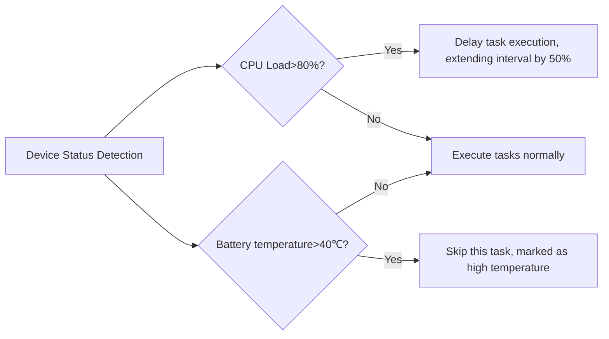

#Hongmeng low-power data synchronization practice: "Energy-saving password" for delayed tasks

hello!I am Xiao L, the female programmer who "fights wits and courage with battery consumption" in the Hongmeng background~ Do you know?Unreasonable data synchronization strategy will increase application power consumption by 50%!Today, let’s reveal how to use Hongmeng delay task to create a smart synchronizer with “Wi-Fi + Charging + Low Peak” to make data updates “insensitive and power-saving”!


## 1. The "three-dimensional coordinate system" for energy-saving synchronization
### (I) Trigger condition matrix
| Dimensions | Options | Combination Strategy | Power Savings |
|--------------|-------------------------------|------------------------------|---------------------------|
| Network type | WIFI_ONLY | Perform large file synchronization only on WiFi | Save mobile traffic and reduce RF power consumption |
| Charge status | CHARGING_WIRED/ WIRELESS | Perform high load tasks while charging | Use external power to avoid battery loss |
| Time Window | 00:00-06:00 (night) | Automatic cleaning at night + full synchronization | Avoid user active periods and reduce CPU usage |
| Battery Power | >70% | Perform non-emergency tasks at high power | Avoid performance de-frequency at low power |

### (II) WorkInfo parameter optimization
```typescript
const syncWork: WorkInfo = {
workId: 'daily-data-sync', // Unique task ID
networkType: NetworkType.NETWORK_TYPE_WIFI, // WiFi only
chargerType: ChargingType.CHARGER_TYPE_ANY, //Wireless charging is available
triggerTime: '03:00', // 3 am (system maintenance period)
repeatCycleTime: 24 * 60 * 60 * 1000, // Once a day
maxExecutionCount: 2, // Failed to try again 1 time
// Task merge: Repeated requests within 12 hours are automatically ignored
    replaceMode: WorkReplaceMode.WORK_REPLACE_MODE_IGNORE_EXISTING,
// Associate application active status (improve scheduling priority)
relatedActiveTime: [9*60*60*1000, 18*60*60*1000] // Priority synchronization during working hours
};
```


## 2. Scenario-based energy-saving strategy: Let the synchronization "take the opportunity"
### (I) "Silent Night" full synchronization
#### Scenario: News applications update hot data in the early morning every day
```typescript
const newsSyncWork: WorkInfo = {
    workId: 'news-daily-update',
    networkType: NetworkType.NETWORK_TYPE_WIFI,
triggerTime: '02:30', // 2:30 am
// Low priority: Allows the system to delay execution until daytime
    priority: WorkPriority.WORK_PRIORITY_LOW,
    abilityName: 'NewsSyncExtensionAbility',
// Traffic optimization: compressed data transmission
    dataCompression: true,
// Power consumption optimization: phased execution (download the summary first, then load the full text)
    executionPhases: [
        { phase: 1, task: 'download-summary' },
        { phase: 2, task: 'load-full-articles', dependsOn: 1 }
    ]
};

workScheduler.startWork(newsSyncWork);
```

#### Optimization points:
1. **Night peak hours**: Use the system's idle resources to reduce the impact on users
2. **Phase execution**: Avoid taking up a lot of memory and network bandwidth at one time
3. **Low priority mark**: Allows the system to dynamically adjust the execution time according to resources

### (II) "Charging Acceleration" incremental synchronization
#### Scenario: Office applications synchronize cloud files while charging
```typescript
const fileSyncWork: WorkInfo = {
    workId: 'file-incremental-sync',
chargerType: ChargingType.CHARGER_TYPE_FAST, // During fast charging
    batteryLevelTriggerType: BatteryLevelTriggerType.BATTERY_LEVEL_ABOVE,
batteryLevel: 80, // Power capacity >80% (avoid high load in the early stage of charging)
    abilityName: 'FileSyncExtensionAbility',
// Incremental synchronization policy: Only transfer of change files
    syncType: SyncType.SYNC_TYPE_INCREMENTAL,
// Network optimization: Use HTTP/2 multiplexing
    networkOptimization: true
};

workScheduler.startWork(fileSyncWork);
```

#### Optimization points:
1. ** Charging + high battery dual guarantee**: Use external power supply to support high power consumption operation
2. **Incremental Synchronization**: Reduce data transmission, save traffic and time
3. **HTTP/2 optimization**: Improve network transmission efficiency and reduce connection time

### (III) Real-time synchronization of "Wi-Fi priority"
#### Scenario: Weather app updates the radar map when switching to Wi-Fi
```typescript
const weatherSyncWork: WorkInfo = {
    workId: 'weather-radar-update',
networkType: NetworkType.NETWORK_TYPE_WIFI, // WiFi only
// Instant trigger: Execute within 5 minutes after Wi-Fi connection
    scheduleType: ScheduleType.SCHEDULE_TYPE_EXACT,
    exactTime: new Date().getTime() + 300 * 1000,
    abilityName: 'WeatherSyncExtensionAbility',
// Data sharding: load radar map data in 3 times
    dataChunks: 3,
// Timeout processing: Cancel if it is not completed in 10 minutes
    timeout: 600 * 1000
};

workScheduler.startWork(weatherSyncWork);
```

#### Optimization points:
1. **Wi-Fi instant trigger**: Capture scenes where users may be stationary and improve data real-time
2. **Data sharding**: Avoid excessive memory usage causing the task to be terminated by the system
3. **Timeout mechanism**: Prevent abnormal tasks from occupying resources for a long time


## 3. System scheduling mechanism: the underlying logic of "resource perception"
### (I) Task priority queue
| Priority | Trigger Conditions | Execution Strategy | Typical Scenarios | Power Consumption Ratio |
|----------|-------------------------|-------------------------|------------------------|----------|
| Emergency | Including `urgent` tag + WiFi + charging | Execute immediately, give priority to resource use | Real-time collaborative editing | 15-20% |
| High | WiFi+ Charging | Execution within 30 minutes | Large file backup | 8-12% |
| Intermediate | WiFi or charging | Execute within 2 hours | General data synchronization | 3-5% |
| Low | No special conditions | Merged into system maintenance period for execution | Log reporting | <1% |

### (II) Merge execution algorithm
```typescript
// Merge similar tasks (such as weather synchronization for multiple applications)
workInfo.triggerContent = {
mergePolicy: MergePolicy.MERGE_POLICY_COALESCE, // Merge the same tasks
coalesceDelay: 60 * 60 * 1000 // Repeat trigger within 1 hour and merge
};

// The system automatically merges multiple weather synchronization requests into a single network operation
```

### (III) Dynamic frequency reduction strategy



## 4. Practical case: "Smart Office" synchronization system is implemented in the entire process
### Scene description:
Enterprise office applications need to automatically synchronize attendance data (Wi-Fi+ charging) in the early morning of daily life. Users will be given priority to perform under Wi-Fi when triggered manually.

### Implementation steps:
#### 1. Automatically synchronize task configuration
```typescript
const autoSyncWork: WorkInfo = {
    workId: 'attendance-daily-sync',
    networkType: NetworkType.NETWORK_TYPE_WIFI,
chargerType: ChargingType.CHARGER_TYPE_WIRED, // Wired charging
    triggerTime: '03:00',
    repeatCycleTime: 24 * 60 * 60 * 1000,
    abilityName: 'AttendanceSyncExtensionAbility',
// Encrypted transmission: using TLS 1.3
    dataSecurity: {
        encryption: true,
        protocol: 'TLSv1.3'
    }
};

workScheduler.startWork(autoSyncWork);
```

#### 2. Manual trigger logic
```typescript
function triggerManualSync() {
    if (networkManager.getConnectionType() === NetworkType.NETWORK_TYPE_WIFI) {
        const manualWork: WorkInfo = {
            ...autoSyncWork,
            workId: 'attendance-manual-sync',
            scheduleType: ScheduleType.SCHEDULE_TYPE_EXACT,
            exactTime: Date.now()
        };
        workScheduler.startWork(manualWork);
    } else {
showToast('Please try again after connecting to Wi-Fi');
    }
}
```

#### 3. Synchronous result processing
```typescript
// Process synchronous results in ExtensionAbility
export default class AttendanceSync extends WorkSchedulerExtensionAbility {
    onStart(workInfo: WorkInfo) {
        syncAttendanceData().then((result) => {
            if (result.success) {
workScheduler.cancelWork(workInfo.workId); // Cancel the task after success
sendSyncReportToServer(); // Send synchronous report
            } else {
// Retry based on the remaining quota after failure
                if (workInfo.executionCount < workInfo.maxExecutionCount) {
workScheduleWork(workInfo.workId, 3600 * 1000); // Try again after 1 hour
                }
            }
        });
    }
}
```


## 5. Pit avoidance guide: "Minefield Inspection" for synchronous tasks
### (I) Parameter configuration trap
1. **Time format error**:
`triggerTime` must be `HH:mm`. If `'25:60'`, it will cause the parsing to fail. Format verification is required.
   ```typescript
   function isValidTime(time: string): boolean {
       const regex = /^([01]\d|2[0-3]):[0-5]\d$/;
       return regex.test(time);
   }
   ```

2. **Repeat task ID conflict**:
Manual triggering and automatic tasks require different `workId` to avoid overwriting each other
   ```typescript
   const WORK_ID_AUTO = 'auto-sync-123';
   const WORK_ID_MANUAL = 'manual-sync-456';
   ```

3. **Ignore system quotas**:
The number of delayed tasks is started per day is limited (default 100 times), and you need to query in advance
   ```typescript
   workScheduler.getWorkQuota().then((quota) => {
       if (quota.remaining > 0) {
           startWork(workInfo);
       } else {
showToast('The number of synchronizations today has been used up');
       }
   });
   ```

### (II) Exception scene processing
1. **Network flash**:
   ```typescript
// Pause task when network disconnection is detected
   networkManager.on('connectionLost', () => {
       workScheduler.pauseWork(workInfo.workId);
   });
// Continue after network recovery
   networkManager.on('connectionRestored', () => {
       workScheduler.resumeWork(workInfo.workId);
   });
   ```

2. **Low battery interrupt**:
   ```typescript
   powerManager.onBatteryLevelChanged((level) => {
       if (level < 15) {
workScheduler.cancelWork(workInfo.workId); // Cancel non-emergency tasks
saveSyncProgress(); // Save progress
       }
   });
   ```

3. **Cross Version Compatibility**:
`chargerType` is not supported by API below 10, and dynamic judgment is required
   ```typescript
   if (apiVersion >= 10) {
       workInfo.chargerType = ChargingType.CHARGER_TYPE_WIRELESS;
   }
   ```


## 6. Cold knowledge: "Hidden skills" for synchronous tasks
### (I) Cross-device collaborative synchronization
```typescript
// Schedule synchronous tasks to Huawei cloud server for execution
const serverDeviceId = 'cloud-server-123';
workScheduler.startWorkOnDevice(workInfo, serverDeviceId);
```

### (II) Task chain dependency
```typescript
// Synchronize the basic data first, then synchronize the associated data
workScheduler.addWorkDependency('base-data-sync', 'related-data-sync');
```

### (III) User behavior perception synchronization
```typescript
// The user opens the application at 9 o'clock for 3 consecutive days, and automatically adjusts the synchronization time to 8:30
userBehaviorManager.learnPattern('morning-open', 9*60*60*1000, () => {
    workInfo.triggerTime = '08:30';
    workScheduler.updateWork(workInfo);
});
```


## Last reminder: "Energy-saving formula" for data synchronization
**Energy saving efficiency = (trigger condition accuracy + task merge rate) × resource utilization**
- The more accurate the trigger conditions (such as WiFi + charging + nighttime), the less invalid wake-up
- The higher the task merge rate (such as merging multiple small tasks as large tasks), the lower the system overhead
- The higher the resource utilization rate (such as using HTTP/2 and data compression), the shorter the time to take for a single synchronization

Want to know how to use Harmony to implement "real-time power consumption monitoring of synchronous tasks"?Follow me and you will unlock new skills next time!If you think the article is useful, share it with the backend classmates in the team. Let us let the data synchronize "silently, full of battery" together!😉
