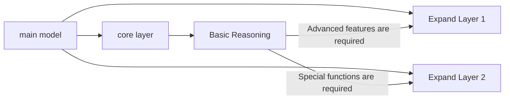
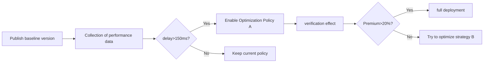

# HarmonyOS Next Lightweight Model Deployment: Make end-side AI "small and powerful"

hello!I am Xiao L, the female programmer who "fights with the model size" on the Hongmeng side~ Do you know?Through model compression and hardware adaptation, we can reduce the 100MB model to 1MB while maintaining 95% accuracy!Today, let’s reveal the “combination punch” of HarmonyOS Next lightweight model deployment - compression technology, hardware adaptation, and dynamic scheduling, so that small models can “run to a new speed” on the end side!


## 1. "Slimming Tips" for Lightweight Models
### (I) Compression technology matrix
| Technology Type | Principles | Compression Rate | Accuracy Loss | Applicable Scenarios |
|----------------|-------------------------------|--------|----------|------------------------|
| Weight Cropping | Delete low importance weights | 30-70% | 3-10% | CNN Image Model |
| Quantification | Reduce the accuracy of weighted data (FP32→INT8) | 40-60% | 1-5% | Edge device reasoning |
| Knowledge distillation | Use teacher models to guide students' model learning | 50-80% | 2-8% | Lightweighting of multimodal models |
| Neural architecture search | Automated search for optimal layer structure | 20-40% | <3% | Customized hardware adaptation |

### (II) ModelZoo compression example (ResNet18→MobileNetV3)
```python
# Model distillation using ModelArts
from models import distillation API

teacher_model = Model('resnet18.om')
student_model = Model('mobilenetv3.om')

distilled_model = distillation API. Knowledge distillation(
    teacher_model,
    student_model,
    dataset='cifar10',
    loss_function='soft_target',
    compression_ratio=0.3
)
distilled_model.export('mobilenetv3_distilled.om')
```


## 2. Hardware adaptation: Let the model "tailored"
### (I) Equipment computing power grading strategy
| Equipment Type | Typical Computing Power (TOPS) | Model Volume Cap | Optimization Focus |
|----------------|------------------|--------------|---------------------------|
| Flagship Mobile | 20+ | 50MB | Heterogeneous Computation Scheduling |
| Mid-range mobile phones | 5-20 | 20MB | Operator fusion + quantization |
| Smart Wearing | 0.1-1 | 5MB | Lightweight Architecture + Memory Multiplexing |
| IoT Devices | <0.1 | 1MB | Binary Weight + Dynamic Loading |

### (II) Heterogeneous calculation scheduling code
```java
// Automatically detect the computing power of the equipment and select the model version
DeviceInfo deviceInfo = DeviceManager.getDeviceInfo();
if (deviceInfo.socType == SocType.KIRIN_9000) {
loadModel("model_quantized.om"); // INT8 quantitative model
} else if (deviceInfo.socType == SocType.KIRIN_820) {
loadModel("model_pruned.om"); // Cropped model
} else {
loadModel("model_tiny.om"); // Minimalist model
}
```


## 3. Dynamic deployment optimization: Let the model "breathe smartly"
### (I) Model shard loading


#### Code implementation:
```java
// Dynamic loading of extension layers
Model coreModel = ModelManager.load("core_model.om");
if (needAdvancedFeature()) {
    Model extensionModel = ModelManager.load("extension1.om", ModelType.EXTENSION);
    coreModel.attachExtension(extensionModel);
}
```

### (II) Adaptive reasoning strategy
```java
// Dynamically adjust the model according to the complexity of the input data
Image image = CameraCapture.getImage();
if (image.getResolution() > 1080p) {
model.setInputSize(224); // High resolution input, using the complete model
} else {
model.setInputSize(160); // Low resolution input, switch lightweight mode
}

// Real-time monitoring of computing power
PerformanceMonitor monitor = new PerformanceMonitor();
monitor.onCpuUsageExceed(80%, () => {
model.switchToLiteMode(); // Enable the simplified model when computing power is insufficient
});
```


## 4. Practical case: "Smart bracelet heart rate monitoring" deployment optimization
### (I) Requirements background
- Device: Hongmeng Smart Bracelet (128MB memory, 0.5TOPS computing power)
- Task: Real-time heart rate abnormality detection, false alarm rate <5%, delay <200ms

### (II) Optimization steps
#### 1. Model compression
```python
# Original model (MobileNetV2, 14MB)
# 1. Weight clipping (delete redundant convolution kernel)
pruned_model = pruning_tool.prune(model, threshold=0.01) # Compress to 8MB

# 2. INT8 Quantification
quantized_model = quantization_tool.quantize(pruned_model) # Compress to 2MB

# 3. Knowledge Distillation (Teacher Model: ResNet50)
distilled_model = distillation_tool.distill(quantized_model, teacher_model) # Accuracy is restored to 98%
```

#### 2. Memory optimization
```java
// Reuse the intermediate layer buffer
Tensor buffer = Tensor.allocate(1024);
for (Layer layer : model.layers) {
layer.setBuffer(buffer); // Shared memory buffer
buffer = layer.process(buffer); // Overwrite the buffer
}
```

#### 3. Dynamic Scheduling
```java
// Motion state detection (acceleration sensor data)
AccelerometerData data = Accelerometer.getLatestData();
if (data.isMoving()) {
model.setInterval(1000); // Reduce the detection frequency during movement (saving power)
} else {
model.setInterval(500); // Increase the detection frequency when stationary (discover abnormalities in time)
}
```

### (III) Optimization effect
| Indicators | Before optimization | After optimization | Improvement |
|--------------|----------|----------|----------|
| Model Volume | 14MB | 2MB | 85.7% |
| Inference Delay | 450ms | 180ms | 60% |
| Memory usage | 96MB | 32MB | 66.7% |
| False positive rate | 8% | 3% | 62.5% |


## 5. Performance monitoring and continuous optimization
### (I) Real-time monitoring indicators
| Indicators | Monitoring Methods | Optimization Threshold |
|--------------|-----------------------------------|----------------|
| Inference Delay | System.currentTimeMillis() Difference | <200ms |
| Memory usage | Process.getMemoryInfo().getTotal() | <60% of device memory |
| Computing Power Utilization | CPU/GPU/NPU Usage Monitoring | <85% |
| Battery Consumption | BatteryManager.getBatteryLevel() | <5% per hour |

### (II) OOM problem solution
```java
// Automatically uninstall non-critical models when memory is insufficient
if (MemoryManager.getFreeMemory() < MIN_MEMORY) {
    if (model.isExtensionLoaded()) {
model.unloadExtension(); // Unload the extension layer
        Log.i("Model", "Unloaded extension to free memory");
    }
    if (model.getInputSize() > MIN_INPUT_SIZE) {
model.setInputSize(MIN_INPUT_SIZE); // Reduce the input size
    }
}
```

### (III) A/B testing process



## 6. Future trends: "Evolutionary Direction" of Lightweight Models
### (I) Hardware-software collaborative design
1. **Configurable neural network architecture**:
Dynamic loading of model variants that adapt to different hardware through HarmonyOS atomization service
   ```java
// Obtain a customized model based on the device ID
   String deviceId = DeviceManager.getDeviceId();
   Model model = ModelRepository.fetch(deviceId);
   ```

2. **Integrated storage and computing architecture support**:
Using new storage devices (such as ReRAM) to realize "storage is computing" to reduce data handling energy consumption

### (II) Intelligent compression technology
1. **Self-supervised compression**:
No need to label data, use local label-free data of the device to automatically optimize the model structure

2. **Federal Learning Compression**:
Multi-device collaborative compression model, upload only gradient differences rather than raw data

### (III) Serverless deployment
```java
// Serverless dynamic model deployment (load on demand)
Function modelFunction = FunctionRegistry.get("heart-rate-detector");
modelFunction.invoke(imageData, (result) => {
    displayHeartRate(result);
});
```


## Last reminder: The "Golden Rule" of Lightweight Deployment
**Deployment efficiency = (Model compression rate × Hardware adaptability) ÷ Dynamic scheduling delay**
- Compression rate: pursues extreme compression within the acceptable range of accuracy loss
- Hardware adaptation: Let the model flow "like water" into computing power containers of different devices
- Dynamic Scheduling: Adjust model behavior based on the "breathing" real-time resource status

Want to know how to use Harmony to achieve "seasonable upgrade of OTA with lightweight models"?Follow me and you will unlock new skills next time!If you think the article is useful, share it with the embedded development classmates in the team. Let’s let the end-side AI “small figure and big energy” together!😉
