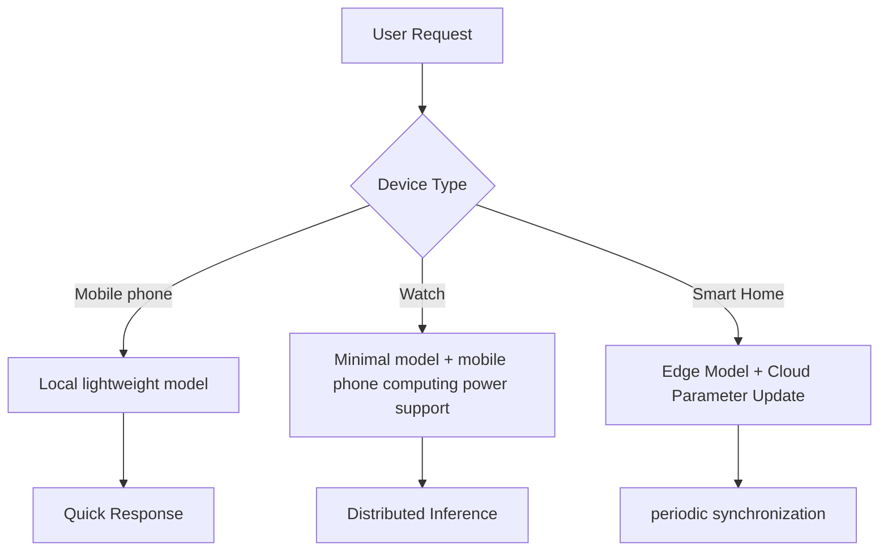

# Huawei Hongmeng Model Lightweight Advanced: The Ecological Evolution Path from "usable" to "easy to use"

hello!I am Xiao L, the female programmer who "leverages model compression technology to leverage 100 billion devices" on the Hongmeng side~ Do you know?When the lightweight model meets Hongmeng distributed capabilities, it can increase the health monitoring accuracy of smart watches by 20%, and reduce power consumption by 30%!Today, let’s talk about the “ultimate form” of model lightweighting in the Hongmeng ecosystem - full-scene collaboration, self-evolution model, and privacy enhancement. Let’s see how the future end-side AI is “smart and considerate”!


## 1. Full-scene collaboration: Let the model "change as needed"
### (I) Cross-device model scheduling architecture


### (II) Implementation of typical scenarios
#### 1. Cross-device collaboration of sports and health
```java
// The watch end minimal model (1MB) is used for initial screening of abnormal heart rate
boolean isAnomaly = watchModel.predict(heartRateData);

if (isAnomaly) {
// Mobile phone loading enhancement model (5MB) for secondary verification
    EnhancedModel enhancedModel = DeviceManager.getRemoteModel("phone");
    Result result = enhancedModel.predict(ecgData);
// Synchronize the abnormal results to the cloud doctor
    CloudSync.send(result, "doctor@hospital.com");
}
```

#### 2. Smart home dynamic networking reasoning
```python
# Discover new devices and join the home network
def onDeviceAdded(device_id):
    if device_id == "smart_camera":
# Camera deployment object detection model (2MB)
        deploy_model(device_id, "yolov5_tiny.om")
    elif device_id == "smart_speaker":
# Speaker deployment voice wake-up model (512KB)
        deploy_model(device_id, "wakeword_v3.om")
# Automatically build device reasoning chain: camera detection → speaker broadcast
    build_inference_chain(["smart_camera", "smart_speaker"])
```


## 2. Self-evolution model: Make the end-side AI "better smarter the more you use it"
### (I) Closed loop of federal learning
```mermaid
graph LR
A[Device-side data acquisition] --> B[Local model update]
B --> C [encrypted gradient upload]
C --> D[Cloud Aggregation Update]
D --> E[Global Model Issued]
E --> F[Equipment Model Upgrade]
```

#### Code implementation:
```java
// Local model training (taking gesture recognition as an example)
LocalTrainer trainer = new LocalTrainer();
trainer.addData(gestureData);
trainer.setPrivacyProtection(PrivacyLevel.HIGH); // Data desensitization processing

// Upload gradient difference
byte[] gradient = trainer.getGradient();
CloudFederatedLearning.upload(gradient, "gesture_model");

// Download the global model
Model globalModel = CloudFederatedLearning.download("gesture_model");
ModelManager.update(globalModel);
```

### (II) Online adaptive optimization
```python
# Real-time monitoring of model errors
def onPredictionError(error):
    if error > THRESHOLD:
# Trigger online learning (fine-tuning with new data)
        fine_tune_model(new_data, learning_rate=0.001)
# Dynamically adjust the model structure (such as adding a layer of convolution)
        model.add_layer(Conv2D(32, kernel_size=3))
# Compress new models to adapt to devices
        compress_model(model, target_size="2MB")
```


## 3. Privacy enhancement: Make data "available and invisible"
### (I) Security multi-party computing
```java
// Multi-party joint modeling (hospital A+hospital B+pharmaceutical companies)
SecureMPC mpc = new SecureMPC();
mpc.addParticipant("hospitalA", "hospitalB", "pharmaCompany");

// Local training for each participant
hospitalA.train(localCancerData);
hospitalB.train(localCancerData);
pharmaCompany.train(medicineData);

// Security aggregation model
Model jointModel = mpc.aggregateModels();
// The model is deployed to the equipment of the grassroots hospital
deployToEdge(jointModel, "communityHospitalDevice");
```

### (II) Homomorphic encryption reasoning
```python
#Encrypted data directly input to the model (taking blood sugar prediction as an example)
encryptedBloodData = homomorphicEncrypt(bloodData);

//Direct state inference (model parameters are pre-encrypted)
encryptedPrediction = model.predict(encryptedBloodData);

// Only users can decrypt the results
userDecrypt(encryptedPrediction, privateKey);
```


## 4. Future technological breakthroughs: Reconstructing the AI ​​boundary on the end side
### (I) Neural Omorphic hardware adaptation
```java
// Compilation of special model for brain-like chips
NeuroCompiler compiler = new NeuroCompiler();
compiler.setArchitecture(NeuralArchitecture.SPIKING);
compiler.compile(model, "brain_chip_model.om");

// Pulse neural network reasoning
SpikingModel spikingModel = loadModel("brain_chip_model.om");
spikingModel.predict(spikeTrainData);
```

### (II) Quantum-classical hybrid model
```python
# Quantum convolutional layer acceleration
QuantumLayer quantumLayer = new QuantumLayer();
quantumLayer.setQubits(8); // 8 qubits
model.addLayer(quantumLayer);

// Classic-quantum joint reasoning
classicalResult = model.predictClassical(imageData);
quantumResult = model.predictQuantum(imageData);
finalResult = fuseResults(classicalResult, quantumResult);
```

### (III) Self-healing model architecture
```mermaid
graph LR
A[Model Damage Detection] --> B{Weighted Anomaly Rate>5%?}
B -->|Yes| C[Activate the self-healing mechanism]
C --> D [Use meta-learning to restore parameters]
D --> E[Compression-repaired model]
B -->|No| F[Normal Reasoning]
```


## 5. Ecological construction: the leap from "technology" to "industry"
### (I) Developer Empowerment System
1. **Automated compression platform**
- Input: Arbitrary framework model (TensorFlow/PyTorch)
- Output: Hongmeng exclusive lightweight model (supports .OM/.HIM dual format)
- Features: One-click cropping/quantization/distillation, real-time preview of the accuracy changes after compression

2. **Hardware Selection Wizard**
   ```javascript
// Automatically recommend equipment based on model parameters
   function recommendDevice(modelSize) {
       if (modelSize < 1MB) return "SmartBand 8";
       if (modelSize < 10MB) return "P60 Pro";
       return "Vision Studio";
   }
   ```

### (II) Industry Solution Matrix
| Industry | Typical Scenarios | Lightweight Solutions | Accuracy-Volume Ratio |
|------------|---------------------------|-------------------------------------|--------------|
| Smart Medical | Heart rate abnormality detection for wearable devices | MobileNetV3+knowledge distillation + INT8 quantification | 95%/1.2MB |
| Intelligent Industry | Real-time visual detection of production line defects | YOLOv5s+Structural pruning+Mixed precision quantization | 92%/3.8MB |
| Smart Education | Real-time evaluation of end-side oral language | LSTM+weight cutting + federated learning | 90%/800KB |
| Smart Transportation | Real-time Pedestrian Detection on Vehicles | EfficientDet-D0+ Neural Architecture Search | 88%/2.5MB |

### (III) Standardization process
1. **Model Interoperability Standard**
Define a cross-vendor model description language (HML, Harmony Model Language), supporting the following features:
- Hardware Compatibility Statement (CPU/GPU/NPU Support List)
- Privacy protection level marking (public/enterprise/sensitive)
- Lifecycle management metadata (training date/compressed version)

2. **Performance Benchmark Set**
The "Hongmeng End-Side AI Model Performance White Paper" was released, including:
- Standard test equipment matrix (covering 90% Hongmeng equipment)
- Multi-dimensional scoring system (delay/power consumption/precision/volume)
- Annual performance rankings (incentive developers to optimize)


## 6. Challenges and responses: The only way to "universal end-side AI"
### (I) Technical Challenges
1. **Game of infinite compression and finite precision**
- Solution: Dynamic accuracy adjustment
     ```java
// Switch accuracy according to task importance
     if (taskType == TaskType.EMERGENCY) {
model.setPrecision(Precision.FP16); // High precision for first aid scenes
     } else {
model.setPrecision(Precision.INT8); // Low precision for regular scenes
     }
     ```

2. **Unified scheduling problems of heterogeneous devices**
- Solution: Reinforcement Learning-based Scheduler
     ```python
     agent = RLAgent()
     agent.learn(
state=device status,
action=model partitioning strategy,
reward=Delay+Power Consumption+Accuracy Comprehensive Score
     )
     ```

### (II) Ecological Challenges
1. **Adaptation cost of fragmented equipment**
- Solution: Atomized Model Service
     ```xml
<!-- Model Service List -->
     <model-service>
         <model id="face_detection" size="2MB">
             <device-support>
                 <device-type>phone</device-type>
                 <device-type>tablet</device-type>
             </device-support>
         </model>
     </model-service>
     ```

2. **Developer skill fault**
- Solution: Low-code compression toolchain
- Visual interface to adjust compression parameters
- Real-time comparison of model performance before and after compression
- Automatically generate model variants that are adapted to different devices


## 7. Ultimate Outlook: When lightweight models meet "digital twins"
Imagine: In the future, every Hongmeng device will have a "digital twin" -
- **Born is lightweight**: When the model is generated, it customizes the compression scheme based on the computing power of the equipment.
- **Growth and Evolution**: Continuously absorb local data upgrade capabilities of equipment through federated learning
- **Death can be migrated**: When the device is eliminated, the model can be seamlessly moved to the new device to continue service

This is not science fiction!With the improvement of Hongmeng ecosystem and the advancement of technology, end-side AI will truly become the "soul of equipment" - as light as a feather, as smart as a human being, as private as fingerprints.And our developers are using lines of code to build the most solid "lightweight cornerstone" for this intelligent future.
