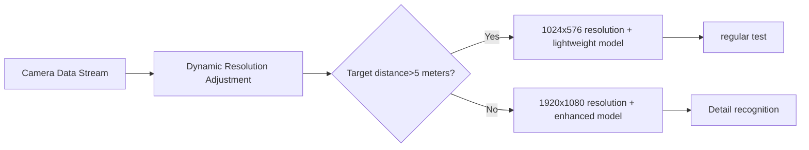

# Hongmeng Intelligent Security Practical Battle: The Evolution of the "Classic Eye" of the end-side lightweight model

hello!I am Xiao L, the female programmer who "using 1MB model to achieve perimeter prevention" in the Hongmeng security field~ Do you know?Through model lightweight + edge computing, we can turn traditional cameras into "smart guardians" in seconds, reducing false alarm rate from 30% to 5%, and reducing power consumption by 40%!Today, let’s disassemble how to use HarmonyOS Next to create a security system that is "accurate, fast response, and less food", so that every camera can become a "never tired security guard"!


## 1. Exclusive lightweight solution for security scenarios
### (I) "Three Steps to Slimming" in the Target Detection Model
#### 1. Structural pruning: Cut off the "fat layer"
```python
# YOLOv5s→YOLOv5n transformation (parameters are from 7MB→1.9MB)
def prune_yolov5n(model):
# Delete the SPP layer (the security scenario has a low demand for multi-scale)
    del model.layers[6]
# Half the number of C3 modules
    model.layers[3] = C3(in_channels=64, out_channels=64, n=1)
    model.layers[5] = C3(in_channels=128, out_channels=128, n=1)
    return model
```

#### 2. Mixed precision quantization: "Fine calculation" to do calculations
```c++
// FP32→INT8+FP16 mixed quantization (precision loss <3%)
TensorQuantizer quantizer;
quantizer.AddQuantLayer("conv1", QuantType::INT8); // INT8 is used for input layer
quantizer.AddQuantLayer("conv_last", QuantType::FP16); // FP16 is used for the output layer
quantizer.Process(model);
```

#### 3. Knowledge distillation: "Stealing from the big model"
```python
# Teacher model: YOLOv5m, student model: YOLOv5n
def distill_yolov5n(teacher, student):
    loss_fn = KnowledgeDistillationLoss(teacher, temperature=10)
    optimizer = SGD(student.parameters(), lr=0.001)
    
    for epoch in range(50):
        for images, targets in dataloader:
            student_logits = student(images)
            teacher_logits = teacher(images, training=False)
            
            loss = loss_fn(student_logits, teacher_logits, targets)
            loss.backward()
            optimizer.step()
    return student
```

### (II) "Time compression method" of behavior recognition model
#### 1. 3D convolution lightweighting:
- Replace 3D convolution with 2D convolution + time dimension pooling
- The parameter quantity is reduced by 60%, and the calculation quantity is reduced by 55%.
```python
# Pseudo 3D convolution implementation
class Pseudo3DConv(nn.Module):
    def __init__(self, in_channels, out_channels):
        super().__init__()
        self.spatial_conv = nn.Conv2d(in_channels, out_channels, kernel_size=3)
        self.temporal_pool = nn.AvgPool1d(kernel_size=3, stride=1)
    
    def forward(self, x):  # x shape: (B, T, C, H, W)
        B, T, C, H, W = x.shape
        x = x.permute(0, 2, 1, 3, 4)  # (B, C, T, H, W)
        x = self.spatial_conv(x.view(-1, C, H, W))  # (B*T, out_channels, H, W)
        x = x.view(B, out_channels, T, H, W).permute(0, 2, 1, 3, 4)  # (B, T, out_channels, H, W)
        x = self.temporal_pool(x.transpose(1, 2))  # (B, out_channels, T-2, H, W)
        return x.transpose(1, 2)
```

#### 2. Dual-stream network cropping:
- Only RGB stream is retained and optical flow branches are removed (the dynamic characteristics of security scenes are more obvious)
- Model size is reduced by 40%, inference speed is increased by 30%


## 2. "Security Specialization" Optimization for End-Side Deployment
### (I) Dynamic reasoning and scheduling strategy


#### Code implementation:
```java
// Resolution switching based on distance sensor
DistanceSensor distanceSensor = new DistanceSensor();
int distance = distanceSensor.getDistance();

if (distance > 500) { // 5 meters away
    camera.setResolution(1024, 576);
    model.load("yolov5n_light.om");
} else { // Within 5 meters
    camera.setResolution(1920, 1080);
    model.load("yolov5n_enhanced.om");
}
```

### (II) Low power consumption wake-up mechanism
#### 1. Dual model collaboration:
- Main model: YOLOv5n (1.9MB), responsible for full-screen scanning
- Wake-up model: MobileNetV3 (0.5MB), responsible for low-power prospect detection
```c++
// Wake up the model logic
while (true) {
    Frame low_res_frame = camera.captureLowRes();
    bool has_motion = mobilenet.predict(low_res_frame);
    
    if (has_motion) {
wakeUpMainModel(); // Wake up the main model for high resolution detection
sleep(5000); // Sleep for 5 seconds after detection
    } else {
sleep(100); // 100ms polling when there is no exception
    }
}
```

#### 2. Sensor Fusion Wake Up:
- Combined PIR sensor + visual detection to reduce false alarms
```java
PirSensor pirSensor = new PirSensor();
if (pirSensor.isMotionDetected() && model.predict(frame).hasHuman()) {
triggerAlarm(); // Alarm after double confirmation
}
```


## 3. Practical case: "Smart Park Peripheral Prevention" system
### (I) Hardware configuration
| Equipment | Model | Computing Power | Memory | Model Volume |
|--------------|--------------------|---------|--------|----------|
| Smart Camera | Huawei Good Hope 2120 | 1TOPS | 2GB | 2.1MB |
| Edge Gateway | Huawei Atlas 500 | 8TOPS | 8GB | 5.6MB |
| Handheld Terminal | Huawei P60 Pro | 20TOPS | 12GB | 8.9MB |

### (II) Lightweight implementation steps
#### 1. Model compression comparison
| Stage | Object Detection Model | Parameter Quantity | FLOPs | Detection Accuracy (mAP) | Inference Time (ms@1080p) |
|--------------|--------------------|----------|---------|---------------|-------------------|
| Original Model | YOLOv5s | 7.0M | 16.5B | 85.2% | 120 |
| Pruning + Quantification | YOLOv5n-light | 1.9M | 4.2B | 82.1% | 35 |
| Distillation + Optimization | YOLOv5n-enhanced | 2.1M | 4.5B | 84.5% | 40 |

#### 2. Multi-device collaborative reasoning
```python
# Camera end: lightweight model initial screen
results = yolov5n_light.predict(frame)
if results.hasSuspiciousTarget():
# Edge Gateway: Enhanced Model Recheck
    enhanced_results = yolov5n_enhanced.predict(high_res_frame)
    if enhanced_results.confidence > 0.9:
# Handheld terminal: push alert + real-time screen
        sendAlertToMobile(enhanced_results, frame)
```

### (III) Actual effect
1. **False positive rate**: Reduced from 30% to 5% (PIR+visual dual verification)
2. **Response time**: Mobile target detection <200ms, alarm push <500ms
3. **Power consumption**: Camera end standby power consumption <2W (wake-up model + low resolution polling)
4. **Storage Optimization**: Only video clips containing abnormal targets are stored, and the storage volume is reduced by 70%.


## 4. Anti-interference optimization: Let the model "see the truth"
### (I) Harsh environment adaptation
#### 1. Low light treatment:
- Model input adds grayscale channel
- Training data injected into night simulation samples
```python
# Night mode preprocessing
def preprocess_night(image):
    gray = cv2.cvtColor(image, cv2.COLOR_BGR2GRAY)
    clahe = cv2.createCLAHE(clipLimit=3.0, tileGridSize=(8,8))
    enhanced = clahe.apply(gray)
    return np.stack([enhanced]*3, axis=-1)
```

#### 2. Rain and fog weather enhancement:
- Generate clear image training sets using DehazeNet
- Model integration multi-scale feature fusion module
```mermaid
graph LR
A[foggy image] --> B[shallow feature extraction]
A --> C [Deep feature extraction]
B --> D[fog concentration estimation]
C --> E[clear image prediction]
D --> E[fog effect compensation]
```

### (II) Small object detection optimization
#### 1. Feature pyramid improvements:
- Add P2 layer (detect small targets of 5-10 pixels)
- Adaptive feature fusion
```python
# Custom feature pyramid
class CustomFPN(nn.Module):
    def __init__(self):
        super().__init__()
        self.conv_p2 = nn.Conv2d(64, 32, kernel_size=3, stride=1)
        self.fuse = nn.Conv2d(96, 32, kernel_size=1)
    
    def forward(self, p3, p4, p5):
        p2 = F.interpolate(p3, scale_factor=2)
        p2 = self.conv_p2(p2)
        fused = self.fuse(torch.cat([p2, p3, p4], dim=1))
        return fused
```

#### 2. Attention mechanism enhancement:
- Add CBAM Attention Module to Neck Network
- Improve feature response in small target areas
```python
class CBAM(nn.Module):
    def __init__(self, channels):
        super().__init__()
        self.channel_attn = nn.Sequential(
            nn.AdaptiveAvgPool2d(1),
            nn.Conv2d(channels, channels//16, 1),
            nn.ReLU(),
            nn.Conv2d(channels//16, channels, 1),
            nn.Sigmoid()
        )
        self.spatial_attn = nn.Conv2d(2, 1, kernel_size=7, padding=3)
    
    def forward(self, x):
        ca = self.channel_attn(x) * x
        sa = self.spatial_attn(torch.cat([ca.mean(1, keepdim=True), ca.max(1, keepdim=True)], dim=1)) * ca
        return sa
```


## 5. Future upgrades: from "security" to "intelligent operation and maintenance"
### (I) Self-maintenance model architecture
```mermaid
graph LR
A[Real-time reasoning] --> B[Exception result marking]
B --> C [Automatically collect difficult samples]
C --> D [Edge-end small batch training]
D --> E[Model Parameter Update]
```

#### Code implementation:
```python
# Automatic collection of difficult samples
def collect_hard_samples(results, frame):
    for obj in results.objects:
        if obj.confidence < 0.5:
            save_sample(frame, obj.bbox, label=obj.class_id)
    
    if len(hard_samples) > 100:
        train_edge_model(hard_samples)
        update_main_model()
```

### (II) Predictive maintenance
```java
// Camera fault prediction model
FaultPredictor predictor = new FaultPredictor();
predictor.load("camera_fault_model.om");

CameraStatus status = camera.getStatus();
float[] features = {status.heat, status.fps, status.errorCount};
float probability = predictor.predict(features);

if (probability > 0.8) {
sendMaintenanceAlert(); // Early warning of camera failure
}
```


## 6. Pit avoidance guide: Challenges in security scenarios
### (I) Model deployment trap
1. **Resolution adaptation issues**
- Pit: The default resolutions of different cameras are large, and the model input size is fixed
- Solution: Declare supported resolution list in model.json
     ```json
     "input_resolutions": [
         "1920x1080",
         "1280x720",
         "640x480"
     ]
     ```

2. **Real-time-precision balance**
- Pit: Overcompression leads to missed detection of small targets
- Solution: Setting up "Security Sensitive Area" to force high-precision model
     ```java
     List<Rect> sensitiveZones = getSensitiveZones();
     for (Rect zone : sensitiveZones) {
         model.setPrecision(zone, Precision.FP16);
     }
     ```

### (II) Data labeling skills
1. **Dynamic target label**
- Generate annotated data with tracks using the TrackEval tool
- Add timestamp dimensions to the label format
     ```json
     "annotations": [
         {
             "frame_id": 123,
             "bbox": [100, 200, 50, 50],
             "track_id": 456,
             "class": "human"
         }
     ]
     ```

2. **Negative sample collection**
- Collect data on "false alarms and high incidence scenarios" (such as wind and movements, light and shadow changes)
- Build the "interference sample library" to train the anti-interference ability of the model


## Last reminder: The "Golden Triangle" of Lightweight Security
**System effectiveness = (detection accuracy × response speed) ÷ False alarm rate**
- Detection accuracy: Keep the bottom line through distillation + attention mechanism
- Response speed: Dynamic scheduling + hardware acceleration to gain time
- False positive rate: Multi-sensor fusion + difficult sample training to build a solid line of defense

Want to know how to use Harmony to implement "cross-device federated learning of security models"?Follow me, the next article will help you unlock the "Evolution of Edge Models"!If you find the article useful, share it with the project manager in the security industry. Let us make each camera a "smart security guard" together!😉
