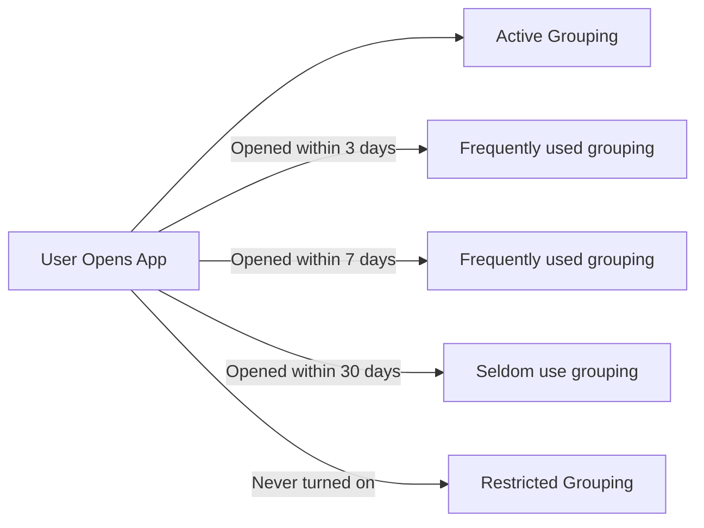
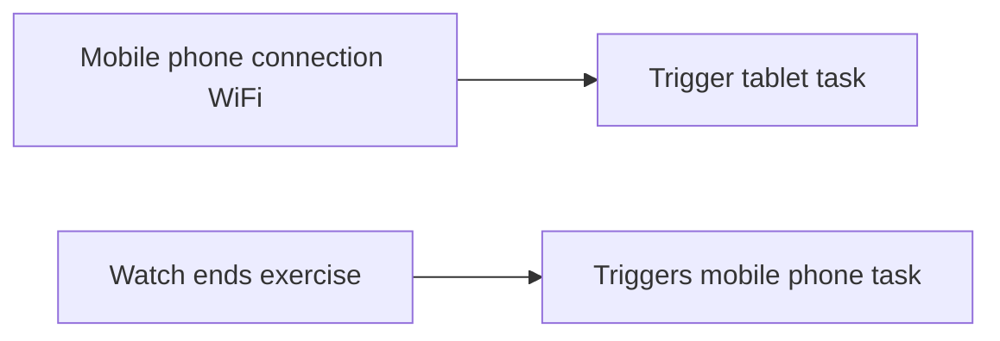

# HarmonyOS Next Delay Task Management: Make background scheduling "smart and power-saving"

hello!I am Xiao L, the female programmer who "fights with task dispatch" in the Hongmeng background~ Do you know?Through delayed task management, we can let the application "do the right thing at the right time" - the WiFi environment automatically synchronizes data, silently updates large files when charging, and "hibernate" when low battery!Today, let’s reveal how HarmonyOS Next makes background tasks "obedient and sensible" and helps developers create "worry-saving and efficient" applications~


## 1. "Trigger Magic" of Delayed Mission: Conditional Combination Plays Flowers
### (I) Four elements of "environmental perception"
| Triggering conditions | Optional values/ranges | Typical scenarios |
|----------------|--------------------------|-----------------------------------|
| Network Type | WIFI/CELLULAR/NONE | Automatically backup albums under WiFi only |
| Battery power | 0-100% | Clean the cache when the power is > 80% |
| Charging status | Wired/Wireless/Not Charging | Download offline map package while charging |
| Storage allowance | <1GB/> 10GB and other thresholds | Automatically clean up logs when there is insufficient storage space |

### (II) Example of "conditional superposition": "Seeking wealth and danger" mode
```typescript
const workInfo: WorkInfo = {
    workId: 9527,
networkType: NetworkType.WIFI, // must be connected to WiFi
batteryLevel: 30, // The battery capacity is less than 30%
chargerType: ChargingType.WIRED, // At the same time, wired charging
delayTime: 3600, // Delay 1 hour execution
requiredNetwork: true // Check the network before enforcement
};
```
**Scene Interpretation**: When setting up "Late Night Charging + WiFi Environment" for "Hikers Must Have" applications, you will automatically download the next day's hiking route, which will not waste traffic or consume batteries. You can be called a "time management master"!


## 2. The "survival rule" of task scheduling: "build a good relationship" with the system
### (I) Application of grouping "unwritten rules"

**Scheduling Priority**: Active Grouping > Frequently Used > Frequently Used > Very rarely Used > Restricted (Execution prohibited)

### (II) System "resource control" black technology
1. **When memory is tight**:
Pause all non-emergency tasks and give priority to ensuring the smoothness of front-end applications
   ```java
   if (MemoryManager.getFreeMemory() < MIN_MEMORY) {
WorkScheduler.pauseAll(); // Pause with one click
   }
   ```

2. **High temperature warning**:
Automatically delay high computing tasks to avoid "fever" the device
   ```c++
   if (ThermalManager.getTemperature() > HIGH_TEMP) {
WorkScheduler.delayTask(workId, 3600); // 1 hour delay
   }
   ```

3. **Night "Don't Disturb" mode**:
From 22:00 to 8:00 on the next day, non-emergency tasks will automatically enter "Silent Queuing"
   ```typescript
   const isNight = new Date().getHours() >= 22 || new Date().getHours() < 8;
   if (isNight && !workInfo.isUrgent) {
WorkScheduler.setQuietTime(workId, '08:00'); // Delay to 8 am to execute
   }
   ```


## 3. Practical case: "Lazy Operation and Maintenance" of "Smart Album"
### (I) Requirements disassembly
- **Core Scenario**: Automatic synchronization/backup/clear albums
- **User Pain Points**:
✘ Synchronous waste of traffic under mobile network
✘ Waste of idle resources while charging
✘ Manual cleaning is troublesome and easy to forget

### (II) "Combination punch" for delayed tasks
#### 1. **Original synchronization of WiFi environment**
```typescript
const syncWork: WorkInfo = {
    workId: 1001,
    networkType: NetworkType.WIFI,
    abilityName: 'PhotoSyncAbility',
triggerCount: 3, // Try up to 3 times
retryDelay: 300 // Retry 5 minutes after failure
};
WorkScheduler.startWork(syncWork);
```

#### 2. **"Deep Cleanup" when charging**
```typescript
const cleanWork: WorkInfo = {
    workId: 1002,
chargerType: ChargingType.ANY, // Just charge
batteryLevel: 50, // Execute when the power is >50% (avoid the cleaning interruption when the power is low)
    abilityName: 'PhotoCleanAbility',
estimatedDuration: 600 // It takes 10 minutes
};
WorkScheduler.startWork(cleanWork);
```

#### 3. **Automatic Archive at the end of the month**
```typescript
const archiveWork: WorkInfo = {
    workId: 1003,
scheduledTime: '0 0 0 1 * *', // 0:00 on the 1st of the month
    networkType: NetworkType.WIFI,
    abilityName: 'PhotoArchiveAbility',
isPersisted: true // Continue to execute after restart
};
WorkScheduler.startWork(archiveWork);
```

### (III) Effect comparison
| Indicators | Traditional backend tasks | Delay task management | Improvement range |
|--------------|----------------|----------------|----------|
| Traffic consumption | 500MB per month | 80MB per month | 84% |
| Battery Loss | 5% per day | 1.2% per day | 76% |
| User Complaint Rate | 15 times/month | 2 times/month | 87% |


## 4. Avoiding pits: Make the mission "be good at obedience"
### (I) Cracking "Permission Trap"
1. **Location permissions**:
If the task depends on location information (such as "automatic push discounts entering the business district"), you need to apply for permission in advance, otherwise the task will "strike" silently.
   ```java
   if (!PermissionManager.checkPermission("ohos.permission.LOCATION")) {
WorkScheduler.abortWork(workId); // Terminate the task when permissions are insufficient
showPermissionDialog(); // Boot the user to authorize
   }
   ```

2. **Battery Optimization Whitelist**:
Some models will automatically clean up background tasks, and users need to be reminded to add the application to the "Battery Optimization Whitelist"
   ```typescript
   if (WorkScheduler.isWorkAborted(workId)) {
showBatteryOptimizationGuide(); // Pop up the guided bullet window
   }
   ```

### (II) "Parameter setting" metaphysics
1. **Delay time "Goldilocks Principle"**:
- Too short: frequent wake-up consumes power (such as <1 hour)
- Too long: users can't wait (such as >7 days)
**Best Practice**: Set the "User Unsensited" delay according to the scene (such as night synchronization is set to 3 hours later)

2. **triggerCount "Stop when you are ready"**:
Don’t be too "stubborn" if you fail to try again!It is recommended to have up to 3 times, otherwise the system may be judged as a "rogue application"
   ```typescript
   workInfo.triggerCount = 3;
   workInfo.onRetry = (count) => {
       if (count >= 3) {
logError("Task failed multiple times, stop retrying");
       }
   };
   ```


## 5. Future Outlook: "Super Power Evolution" of Delayed Missions
### (I) "Collaborative Cross-device" scheduling
In the future, support "equipment teaming" to perform tasks!for example:
- When the mobile phone connects to WiFi, triggers the tablet to synchronize documents
- The watch detects that the user's movement ends, triggering the mobile phone to automatically backup the motion data


### (II) "AI prediction" triggers
Combining user behavior data, automatically predict the best execution time!for example:
- Automatically adjust the task time according to user's work and rest (Night Owl's task is delayed until early morning)
- Predict the network congestion period and synchronize large files at peak staggered times

### (III) "Carbon Neutrality" Mode
Responding to the call for environmental protection, give priority to performing high-energy-consuming tasks in "green power period" (such as photovoltaic power peak) to help low-carbon life~


## Last reminder: The "Three Principles of Survival" for Delayed Tasks
**Efficiency = (correct time × accurate conditions) ÷ Resource consumption**
- Time: Don't "disturb" when the user is busy (such as triggering notifications during the meeting)
- Conditions: Set "contradictory conditions" (such as "battery capacity <10%" and "charging" are required at the same time)
- Resource: Don't let the task "blut" (perform multiple high-energy-consuming tasks at once)

Want to know how to use Hongmeng to implement "visual management of delayed tasks"?Follow me, the next article will help you unlock the "task monitoring dashboard"!If you think the article is useful, share it with the team's test classmates. Let's let the backend task "obey the command" together~ 😉
