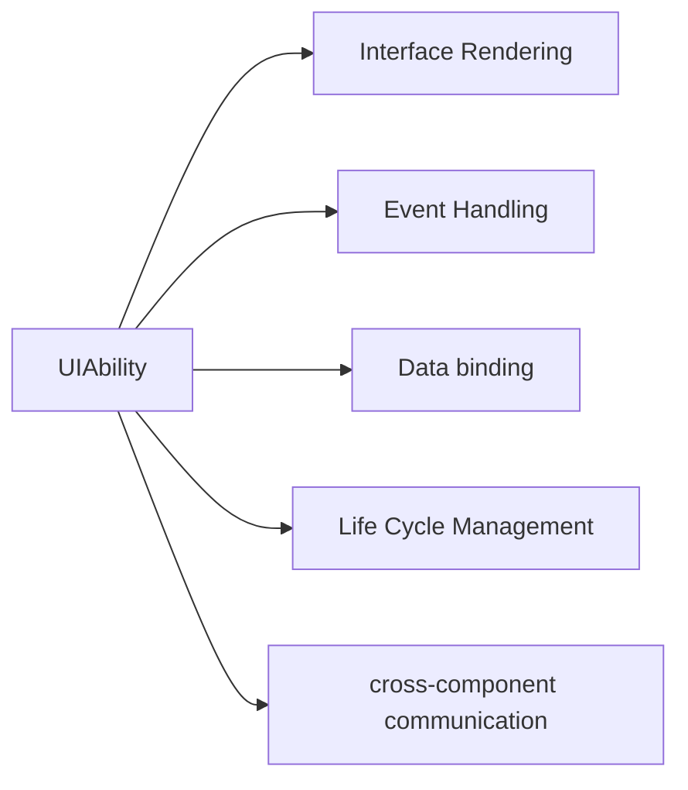

# Hongmeng UIAbility: "Stage Protagonist" to build interactive interface🎭

hello!I am Xiao L, the female programmer who "plays interactive magic" in Hongmeng interface development~ Do you know?On the stage of Hongmeng application, **UIAbility** is the well-deserved "protagonist" - all interfaces that users can see, click and slide are created by it!Today, let’s talk about the core capabilities of this “interface responsibility” and see how it makes the user experience “live”~


## 1. What is UIAbility?The "creator" of the interface world🌏
**Essential Positioning**:
- "Interface Portal" of Hongmeng Application, each UIAbility corresponds to an independent interface (such as home page, details page)
- Implement interface rendering based on the ArkUI framework, supporting declarative UI programming
- Responsible for user interaction event processing, interface life cycle management and data-driven update

**Core Capability Map**:



## 2. Life cycle management: The protagonist's "stage script" 📜
### (I) Four key stages
| Stage | Trigger timing | Core callback | Typical operations |
|--------------|-----------------------------------|-------------------|-----------------------------------|
| **Create** | When component instance is initialized | onCreate() | Load layout file, initialize data model |
| **Front Office** | The interface is visible (user opens or switches back) | onForeground() | Apply for focus, starts animation, updates real-time data |
| **Backend** | The interface is not visible (user returns or locks the screen) | onBackground() | Release non-essential resources, pause animation |
| **Destruction** | When the component is completely destroyed | onDestroy() | Clean up memory and close network connections |

### (II) Code example: Status saving and recovery
```typescript
export default class MainAbility extends UIAbility {
  private state: AppState = { count: 0 };

// Restore animation status in the foreground
  onForeground() {
this.animation.play(); // Start page loading animation
  }

// Save interface status in the background
  onBackground() {
LocalStorage.set('mainState', this.state); // Store to local
  }

// Clean the timer during destruction
  onDestroy() {
clearInterval(this.timer); // Stop data polling
  }
}
```


## 3. Interface rendering practice: Use ArkUI to build a "visual stage" 🎨
### (I) Declarative UI Basics
**Core idea**: Use code to describe the interface "what it looks like", not "how to implement it"
```typescript
// A simple counter interface
@Entry
@Component
struct Counter {
  @State count: number = 0;

  build() {
    Column() {
Text(`Number of clicks: ${this.count}`)
        .fontSize(24)
        .margin(16);
      Button('+1')
        .fontSize(18)
        .padding(12)
        .onClick(() => this.count++);
    }
    .width('100%')
    .height('100%')
    .justifyContent(FlexAlign.Center);
  }
}
```

### (II) Data-driven update
**Principle**: Automatic binding of data and interface through `@State` or `@Link` decorator
```typescript
@Entry
@Component
struct DataBindingDemo {
@State user: User = { name: 'Little L', age: 28 };

  build() {
    Row() {
Text(`Name: ${this.user.name}`).fontSize(20);
Button('Modify Name').onClick(() => {
this.user.name = 'Hongmeng Developer'; // Automatic refresh of the interface when data changes
      });
    }
  }
}
```


## 4. Event processing: "Interactive script" with users🤝
### (I) Basic interactive events
| Event Type | Sample Code | Application Scenario |
|----------------|-----------------------------------|---------------------------|
| Click event | `.onClick(() => {})` | Button click, card selection |
| Slide Event | `.onSwipe((event) => {})` | List Slide, Gesture Navigation |
| Input Event | `.onChange((value) => {})` | Real-time verification of input box |
| Focus Events | `.onFocus((hasFocus) => {})` | Form Input Box Status Feedback |

### (II) Gesture combination event
```typescript
// Long press + swipe combination gesture
Column()
  .onLongPress(() => {
console.log('Long press to start');
  })
  .onSwipe((event) => {
    if (event.direction === SwipeDirection.Right) {
      this.navigateToPrevious();
    }
  });
```


## 5. Cross-component communication: collaboration between the protagonist and the "behind the scenes team" 📞
### (I) EventHub event bus
**Scenario**: Page A and Page B communicate in two directions
```typescript
// Page A sends event
EventHub.create('pageEvent').publish('updateData', { key: 'value' });

// Page B Subscription Event
EventHub.create('pageEvent').on('updateData', (data) => {
  this.refreshUI(data);
});
```

### (II) AppStorage global status
**Scenario**: Multiple pages share user login status
```typescript
// Login page storage status
AppStorage.SetOrCreate('userToken', 'abc123');

// Get status on other pages
const token = AppStorage.Get('userToken');
if (token) {
  this.loadUserProfile();
}
```

### (III) Cross-Ability Communication (Want)
**Scenario**: Start the details page from the home page and pass parameters
```typescript
// Home page startup code
const want = {
  bundleName: 'com.example.app',
  abilityName: 'DetailAbility',
  parameters: { id: 123 }
};
this.context.startAbility(want);

// Details page receive parameters
const id = this.want.parameters?.id;
```


## 6. Startup mode and instance management: The protagonist's "appearance method" 🎬
### (I) Comparison of three startup modes
| Mode | Features | Typical Scenarios |
|--------------|-------------------------------|---------------------------|
| singleton | Global single instance, repeatedly start the reused instance | Shopping cart page (unique entrance) |
| multiton | Multiple instances, create a new instance every time you start | Product Details Page (can open multiple instances at the same time) |
| specified | Specified | Specify Key to start a specific instance | Multiple account switching (each account independent instance) |

### (II) Specific mode practical combat
```typescript
// Manage instance key in AbilityStage
export default class AppStage extends AbilityStage {
  onAcceptWant(want: Want): string {
    if (want.abilityName === 'UserCenterAbility') {
return `user_${want.parameters?.accountId}`; // Generate a unique Key based on the account ID
    }
    return super.onAcceptWant(want);
  }
}
```


## 7. Performance optimization: The protagonist's "Stage Efficiency Rules" ⚡
### (I) Avoid over-rendering
**Counterexample**: Performing time-consuming operations in `onCreate` blocking rendering
```typescript
// ❌ Error: Time-consuming network request in the main thread
onCreate() {
this.data = await fetchLargeData(); // Blocking interface loading
}

// ✅ Correct: Use child threads to load data
onCreate() {
new Worker('data-worker.js').postMessage(request); // Background thread processing
}
```

### (II) Reasonable use of cache
**Scenario**: List page caches rendered Items
```typescript
<List>
.cacheStrategy(CacheStrategy.Partial) // Partial cache
  .itemCount(data.length)
  .itemBuilder((index) => {
    return ListItem({ type: index % 2 === 0 ? 'odd' : 'even' });
  })
```

### (III) Animation performance optimization
**suggestion**:
- Complex animations use `Lottie` vector animation instead of bitmap
- Set the animation layer to `willChange: 'transform'` to improve rendering efficiency
```typescript
.Animation({ duration: 300, curve: Curve.EaseInOut })
  .scale({ x: 1.2, y: 1.2 })
.willChange('transform'); // Inform the system to optimize rendering in advance
```


## 8. Future trend: The protagonist's "evolution script" 🚀
### (I) 3D interface support
In the future, ArkUI-X 3D rendering engine may be introduced to support the construction of 3D scenes directly in UIAbility, such as:
```typescript
// 3D model display components (conceived)
ThreeDModel({ src: 'model.obj', scale: 0.5 })
  .position(100, 100, 0)
  .rotationX(45);
```

### (II) Intelligent interaction enhancement
Combined with AI implementation:
- Voice commands directly operate interface elements (such as "click on the search button")
- Sight tracking automatically focuses on components that are currently concerned by users

### (III) Cross-device adaptation
Through distributed technology, interface elements are automatically adapted to different devices:
```typescript
// Dynamic loading of layout according to device type
if (DeviceType.isPhone()) {
Column() { /* Mobile phone layout */ }
} else if (DeviceType.isTablet()) {
Row() { /* Tablet Layout */ }
}
```


## Summary: UIAbility's "Law of Protagonist" 📓
**User experience = (interface fluency × interaction friendliness) ÷ Operation complexity**
- Interface logic puts UIAbility, business logic puts Service
- Data-driven priority, avoid manual operation of DOM
- Split complex scenes into custom components to improve maintainability
