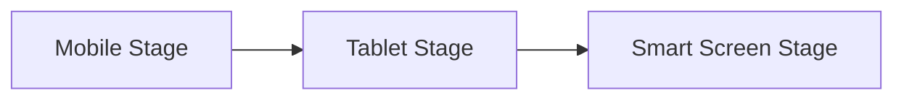

# Hongmeng Stage model: Lightweight and efficient application architecture "stage revolution" 🎭

hello!I am Xiao L, the female programmer who "plays modular development" in Hongmeng architecture~ Do you know?Traditional applications are like a "hodgepodge stage", all functions are squeezed into one process, and Hongmeng's **Stage model is like a "modular theater" - breaking the application into multiple independent "small stages", each stage focuses on one thing, lightweight and efficient!Today, let’s talk about this model that makes the application architecture "changeably" and see how it makes development as flexible as "building blocks"~


## 1. What is the Stage model?"Lego Building Blocks" of Application Architecture🧱
**Core Thought**:
- Split the application into multiple **Stage modules**, each module contains a set of cohesive components (such as UIAbility, Service)
- The modules can achieve "functional decoupling and loading on demand" through process isolation and lightweight communication cooperation.
- Replace the traditional single-process architecture to solve problems such as "application bloat, slow startup, easy crash"

**Key Advantages**:
| Dimensions | Traditional single-process architecture | Stage model |
|--------------|------------------------|--------------------------|
| **Memory usage** | Full loading, high redundancy | Loading on demand, light isolation |
| **Start start** | Slow initialization, blocking interface | Stage startup, second-level response |
| **Mainability** | Functional coupling, one moves the whole body | Modular design, independent upgrade |
| **Security** | No isolation between processes, risk spread | Independent sandbox, precise permission control |


## 2. The "stage component" lineup of the Stage model🎬
### (I) AbilityStage: Director of the Stage
**Role Positioning**:
- "Top Manager" of each Stage module, globally unique
- Responsible for component life cycle management, resource allocation, and process scheduling
- Listen to system events (such as memory alarms, configuration changes)

**Typical Operation**:
```typescript
export default class AppStage extends AbilityStage {
  onCreate() {
// Initialize global resources (such as network request interceptor)
    NetworkManager.init();
  }

  onMemoryLevel(level: MemoryLevel) {
    if (level === MemoryLevel.LEVEL_LOW) {
// Release non-essential resources
      ImageCache.clear();
    }
  }
}
```

### (II) UIAbility: Front-end actor
**Role Positioning**:
- "Interactive interface" directly for users, each UIAbility corresponds to a page
- Responsible for interface rendering, event processing, and data binding
- Can be started across Stage (through Want mechanism)

**Scene Example**:
```typescript
// Product details of e-commerce app Stage
@Entry
@Component
struct ProductDetail extends UIAbility {
  @State product: Product = {};

  onCreate(want: Want) {
// Receive product IDs delivered across Stage
    const productId = want.parameters?.id;
    this.loadProductData(productId);
  }
}
```

### (III) ExtensionAbility: The staff behind the scenes
**Role Positioning**:
- Implement background function expansion (such as service cards, input methods, data sharing)
- Run in a separate process, decoupled from UIAbility
- Support system-level integration (such as desktop widgets, system input methods)

**Scene Example**:
```typescript
// Desktop card Stage for weather application
export class WeatherCard extends FeatureExtensionAbility {
  onCreateContent() {
    return {
      content: {
        data: { temperature: '25℃' },
template: 'weather_card.json' // Card template
      }
    };
  }
}
```


## 3. Communication between stages: "secret channel" between stages🔦
### (I) Lightweight communication method
| Method | Applicable Scenarios | Implementation Principles |
|--------------|------------------------|---------------------------|
| **Want** | Cross-Stage Start Components | IPC Mechanism, Passing Basic Parameters |
| **EventHub** | Real-time event notification | Global event bus, support cross-process |
| **DataAbility**| Structured Data Sharing | URI-based Data Access Protocol |

### (II) Practical case: Cross-Stage data synchronization
**Scene**:
- Select products synchronously with the main Stage (shopping cart) and the sub Stage (checking page)
- Use EventHub to implement bidirectional communication

**Main Stage Send Event**:
```typescript
EventHub.create('cartEvent').publish('updateItems', selectedProducts);
```

**SubStage Subscription Event**:
```typescript
EventHub.create('cartEvent').on('updateItems', (items) => {
this.checkoutItems = items; // Automatically update settlement data
});
```


## 4. Stage model "stage scheduling" strategy🎚️
### (I) On-demand loading mechanism
- **Cold start phase**: Only load the entry Stage (such as the Launcher interface)
- ** When the function is triggered**: Dynamically load the corresponding Stage (such as clicking "My Order" to load the order Stage)
- **Resource Release**: Idle Stages will automatically enter the background, and will be destroyed if they exceed the threshold.

** Advantages**:
- Startup speed increased by 30%+ (actual measured data)
- Memory usage reduction by 40%+ (compare single-process applications)

### (II) Process isolation strategy
| Component Type | Process Mode | Security Level |
|----------------|-------------------|------------|
| UIAbility | Main Stage Process | Medium |
| ServiceExtensionAbility | Independent Process | High |
| System-level ExtensionAbility | Sandbox Process | Highest |

**Configuration Example**:
```json
{
  "abilities": [
    {
      "name": "PaymentService",
      "type": "serviceExtension",
"process": "com.example.payment" // Independent process name
    }
  ]
}
```


## 5. Applicable scenarios: Which applications are suitable for "stage"?📱
### (I) Large-scale and complex applications
**Case**: E-commerce App
- **Stage division**:
- Main Stage: Home page, category browsing
- Trading Stage: Shopping cart, checkout page (independent process, high security level)
- Personal Center Stage: Account Management, Order Inquiry
- ** Advantages**:
- Transaction module is independently encrypted to prevent payment information leakage
- Home page and personal center load in parallel to improve operational fluency

### (II) Atomization Service
**Scenario**: Lightweight services such as weather cards, express inquiry, etc.
- **Stage Features**:
- Single UIAbility + Single ExtensionAbility combination
- Load on demand to the system desktop or other application
- **Technical Implementation**:
  ```typescript
// Atomized service Stage entrance
  export default class WeatherStage extends AbilityStage {
    onAcceptWant() {
return 'weather_stage'; // Specify the Stage unique identifier
    }
  }
  ```

### (III) Cross-device application
**Scene**: Mobile phone and tablet collaborate on editing documents
- **Stage Scheduling**:
- Mobile loading editing interface Stage
- Tablet loading preview Stage (through distributed scheduling mechanism)
- **Communication method**:
- Synchronous editing of content using DDS (Distributed Data Services)


## 6. Future trends: "Upgrade script" of stage model🚀
### (I) Dynamic Stage Loading
Support dynamic addition of Stage modules through hot updates, for example:
- After the main application is released, download the "New Function Stage" as needed and integrate it
- No need to re-release full packages, realize "invisible upgrade" function

### (II) Intelligent resource allocation
Combined with AI to predict user behavior, load the possible Stages in advance:
- Preload the high-frequency function Stage according to user usage habits
- Automatically release low-frequency Stage in the background to optimize resource utilization

### (III) Cross-device Stage Orchestration
In distributed scenarios, automatically orchestrate multi-device Stages to form "super application":

- Mobile phone initiates video conference Stage
- Tablet automatically loads meeting minutes Stage
- Smart screen loading shared screen Stage


## Summary: "Structure Formula" of Stage Model📊
**Application performance = (module decoupling × resource utilization) ÷ coupling complexity**
- Small Stage principle: Each Stage only does one thing to avoid functional redundancy
- Communication minimization: Prioritize lightweight communication and reduce cross-Stage calls
- Security stratification: Independent Stage for sensitive functions (such as payment) to improve isolation
