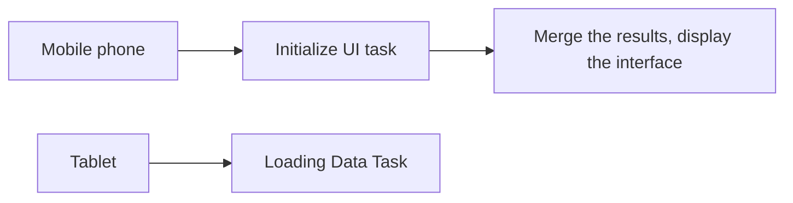

# Hongmeng Next application startup optimization: AppStartup framework in-depth analysis and practical combat📱

hello!I am Xiao L, the female programmer who "fights with startup delay" in Hongmeng development~ Do you know?Application startup is like a race, the initialization task is "loading weight", and the **AppStartup framework is the coach who helps you "plan running routes" - allowing tasks to be executed in an orderly manner, accelerated in parallel, and even "lazy" to delay loading!Today, let’s talk about this magic tool that allows the application to start in seconds, and see how to use it to optimize the startup process~


## 1. What is AppStartup?"Intelligent dispatcher" who starts the process🚀
**Core Positioning**:
- ** Start task management framework provided by Hongmeng Officially**
- Solve problems such as "chaotic tasks, blocking the main thread, and poor performance" at startup
- Through the combination of configuration files + code, the ** sequence control, parallel execution, and delayed loading of tasks can be achieved.

**Core Advantages**:
| Pain points | Traditional solutions | AppStartup solutions |
|--------------------|-------------------------|-------------------------|
| Chaotic task execution order | Manual control, error prone | Automatic sorting of dependencies |
| The main thread is severely blocked | Execute critical tasks synchronously | Execute non-critical tasks asynchronously/parallelly |
| Difficulty in dynamic configuration | High cost of hard-code modification | Hot update of JSON configuration |
| Missing performance monitoring | Manual analysis of log burial points | Built-in performance statistics |


## 2. Core concepts and architecture analysis📊
### (I) Three core components
1. **Task**
- Initialization unit that implements the `IStartupTask` interface
- Example: Database initialization, network configuration, global state loading

2. **Dependency**
- Declare the execution order between tasks through configuration files
- Support **serial dependency** (TaskB depends on TaskA) and **simultaneous execution of ** (dependency-free tasks)

3. **Startup Mode**
- **Automatic mode**: Automatically execute all tasks according to configuration when the application starts
- **Manual mode**: Trigger specific tasks on demand (such as delayed loading when page jumps)

### (II) Execution flow diagram
```mermaid
graph TD
A[Application Start] --> B{Auto/Manual Mode}
B -->|Automatic mode|C[parse config.json]
B -->|Manual mode|D[Call startTask(taskName)]
C --> E[Build task dependency graph]
E --> F[Execute dependency-free tasks in parallel]
F --> G [Execute dependency chain tasks in order]
G --> H [main thread unlocking, interface rendering]
```


## 3. Practical development: build the startup process from 0 to 1🚀
### (I) Configuration file writing (config.json)
**Scene**:
- Initialize the database (serial task)
- Load user preferences (parallel tasks)
- Network configuration (dependent on database initialization)
- Interface initialization (depend on network and preference loading)

```json
{
  "app_startup": [
    {
      "name": "DatabaseInitTask",
"type": "sync", // Synchronize tasks (critical path)
"priority": 100 // High priority, priority execution
    },
    {
      "name": "PrefsLoadTask",
"type": "async", // Asynchronous task (non-critical path)
"parallel": true, // Allow parallel execution
"delay": 500 // Delay 500ms execution (avoid resource preemption)
    },
    {
      "name": "NetworkSetupTask",
"dependentsOn": ["DatabaseInitTask"], // Depend on database tasks
      "type": "sync"
    },
    {
      "name": "UILoadTask",
      "dependsOn": ["NetworkSetupTask", "PrefsLoadTask"],
      "type": "async"
    }
  ]
}
```

### (II) Task development (TypeScript implementation)
**Database initialization task**:
```typescript
import { IStartupTask } from '@ohos.app.startup';

export class DatabaseInitTask implements IStartupTask {
name = 'DatabaseInitTask'; // Must be consistent with the configuration file

// Synchronous execution (critical tasks)
  execute() {
    return new Promise((resolve) => {
DatabaseManager.init(); // Initialize the database
console.log('[DatabaseInitTask] completed');
      resolve();
    });
  }

// Dependless tasks
  getDependencies() {
    return [];
  }
}
```

**User preference loading tasks**:
```typescript
export class PrefsLoadTask implements IStartupTask {
  name = 'PrefsLoadTask';
isParallel = true; // Mark as parallel

  execute() {
    return new Promise((resolve) => {
      setTimeout(() => {
        GlobalState.prefs = LocalStorage.get('user_prefs');
console.log('[PrefsLoadTask] completed');
        resolve();
}, 500); // Delay the simulated IO operation
    });
  }

  getDependencies() {
    return [];
  }
}
```

### (III) Initialization and execution
**Start the framework in AbilityStage**:
```typescript
import { AppStartup } from '@ohos.app.startup';
import { DatabaseInitTask } from './tasks/DatabaseInitTask';
import { PrefsLoadTask } from './tasks/PrefsLoadTask';

export default class AppStage extends AbilityStage {
  onCreate() {
// Register a task
    AppStartup.getInstance()
      .registerTask(new DatabaseInitTask())
      .registerTask(new PrefsLoadTask());

// Enable automatic startup mode
    AppStartup.getInstance().autoStartup();
  }
}
```


## 4. Advanced features: Make startup more "smart" 🧠
### (I) Task priority control
| Priority value | Execution order | Applicable scenarios |
|------------|----------------|------------------------|
| 100-200 | Highest priority | Database/Network Initialization |
| 50-99 | Medium Priority | Configuration Loading, Log Initialization |
| 1-49 | Minimum Priority | Non-essential Features (such as ad preload) |

**Configuration Example**:
```json
{
  "name": "AdPreloadTask",
  "priority": 20,
"delay": 2000 // Delay 2 seconds to avoid affecting the user experience
}
```

### (II) Dynamic task management
**Scenario**: Dynamically load tasks according to device type
```typescript
if (DeviceType.isPhone()) {
  AppStartup.getInstance().registerTask(new MobileOptTask());
} else if (DeviceType.isTablet()) {
  AppStartup.getInstance().registerTask(new TabletOptTask());
}
```

### (III) Performance monitoring and analysis
**内置统计功能**：  
```typescript
const stats = AppStartup.getInstance().getStartupStats();
console.log(`Total time: ${stats.totalTime}ms`);
console.log(`Task time-consuming ranking:`, stats.taskTimes.sort((a,b) => b.time - a.time));
```

**Output Example**:
```
Total time: 850ms
Task time-consuming ranking:
1. DatabaseInitTask - 400ms (synchronous)
2. UILoadTask - 300ms (asynchronous)
3. PrefsLoadTask - 250ms (parallel)
```


## 5. Pit avoidance guide: Start the optimization of "red line" ⚠️
### (I) Avoid excessive parallelism
**Risk**: Too many parallel tasks lead to excessive CPU usage and stuttering of interface
**Solution**:
- Critical tasks (such as permission verification) are set to synchronous and single-threaded
- Non-mission critical limits parallel number (recommended ≤ 3)

### (II) Prevent circular dependencies
**Error configuration**:
```json
{
  "name": "TaskA",
  "dependsOn": ["TaskB"]
},
{
  "name": "TaskB",
  "dependsOn": ["TaskA"]
}
```  
**Consequence**: Starting process is stuck and a circular dependency exception is thrown

### (III) Control the total number of delayed tasks
**Counterexample**:
```json
{
  "name": "TaskX",
"delay": 5000 // Delay for execution for 5 seconds
}
```  
**Risk**: The user may operate the interface during delay, resulting in inconsistent status
**Alternatives**:
- Trigger delayed task using `whenReady()` callback
```typescript
AppStartup.getInstance().whenReady('TaskX', () => {
// Callback after task execution is completed
});
```


## 6. Future trend: "Evolutionary Direction" of the startup framework🚀
### (I) AI-driven intelligent scheduling
- Dynamically adjust task execution order based on user behavior analysis
- For example: High-frequency users preferentially load common function tasks, low-frequency users delay loading secondary tasks

### (II) Cross-device collaborative startup
In a distributed scenario, start tasks are automatically assigned to different devices:

- The mobile phone is responsible for interface rendering, and the tablet/car computer is responsible for data preloading

### (III) No configuration startup
Automatically generate task dependencies through code annotations to reduce manual configuration costs:
```typescript
@StartupTask(dependsOn = ["DatabaseInitTask"], priority = 100)
export class NetworkTask implements IStartupTask { /* ... */ }
```


## Summary: Start the "Golden Formula" for optimization 📊
**Startup performance = (task parallelism × critical path time consuming) ÷ Number of invalid tasks**
- Critical tasks (such as permissions, databases) → Synchronous execution, priority scheduling
- Non-critical tasks (such as logs, advertising) → asynchronous/delayed/parallel execution
- Regularly analyze `getStartupStats()` to eliminate "time-consuming big players"
