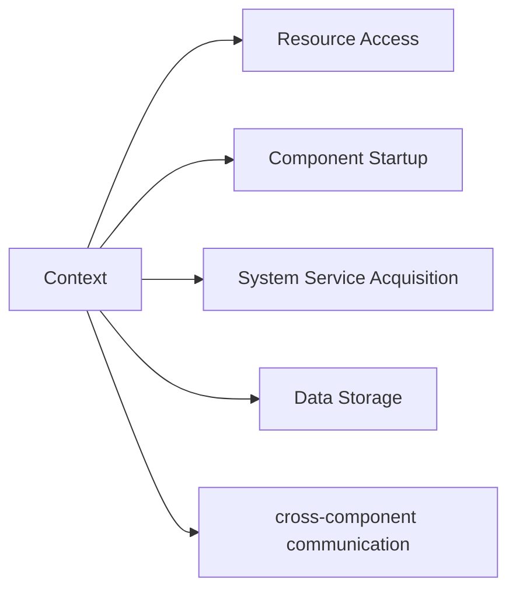

# Hongmeng Context In-depth Analysis: "Master Key" of Application Context🔑

hello!I am Xiao L, the female programmer who "plays around the context" in Hongmeng development~ Do you know?In Hongmeng application, `Context` is like a "master key" - from accessing resources to starting components, from storing data to cross-component communication, almost all operations are inseparable from it!Today, let’s talk about this core concept of “omnipresent” and see how it supports the “full life cycle” of application ~


## 1. What is Context?"Digital ID" for application📄
**Essential Positioning**:
- The globally unique context environment in the Hongmeng system, which runs through the entire life cycle of the application
- Encapsulates the **runtime information of the application (such as package name, resource path, system service reference)
- Provide **bridges across components** (start Ability, access global status)

**Core Competencies**:



## 2. Two core types: "all-round" vs "exclusive type" 👥
### (I) ApplicationContext: Application-level "global housekeeper"
**Features**:
- **Singleton Mode**: The only instance during the entire application run
- **Long Lifecycle**: Create as the application starts and destroys as the application is destroyed
- **Componentless dependencies**: Not bound to any UI components

**Typical uses**:
- Global resource access (such as multilingual configuration, theme style)
- Share status across components (such as user login information)
- Obtain non-component-related system services (such as power management, network status)

**Example**:
```typescript
// Get global context
const appContext = this.context.applicationContext;

// Access global string resources
const appName = appContext.getString('string.app_name');

// Obtain system sensor service
const sensorManager = appContext.getSystemService(Context.SENSOR_SERVICE);
```

### (II) AbilityContext: Component-level "exclusive assistant"
**Features**:
- **Binding with Ability**: Created with Ability creation, destroyed with Ability destruction
- **Short life cycle**: Follow the life cycle of the corresponding Ability
- **Strong component association**: Can directly operate components of the current Ability

**Typical uses**:
- Start the child components of the current Ability (such as AbilitySlice)
- Access interface-related resources (such as layout files for the current page)
- Obtain services related to component status (such as focus management, window management)

**Example**:
```typescript
// Get your own Context in UIAbility
const abilityContext = this.context;

// Start a new AbilitySlice
abilityContext.startAbilitySlice(new Want({
  deviceId: '',
  bundleName: 'com.example.app',
  abilityName: '.DetailAbilitySlice'
}));

// Get the focus manager of the current window
const focusManager = abilityContext.getFocusManager();
```


## 3. Detailed explanation of key functions: "Key" "Lock unlocking posture" 🔓
### (I) Resource access: Open the "Resource Treasure House"
**1. Static resource access**
```typescript
// Access string resources
const title = context.getString('string.title');

// Access image resources
const icon = PixelMap.create(context, 'media:icon');

// Access layout resources
const layout = LayoutScatter.getInstance(context).parse('layout/main_layout');
```

**2. Dynamic resource adaptation**
```typescript
// Load different strings according to device type
if (context.getDeviceType() === DeviceType.PHONE) {
  context.getString('string.phone_only_text');
} else {
  context.getString('string.tablet_text');
}
```

### (II) Component startup: Activate "application cell"
**1. Start UIAbility**
```typescript
const want = {
  bundleName: 'com.example.app',
  abilityName: '.MainAbility',
parameters: { userId: '123' } // Pass parameters
};
context.startAbility(want);
```

**2. Start ServiceExtensionAbility**
```typescript
const serviceWant = {
  deviceId: '',
  bundleName: 'com.example.service',
  abilityName: '.DataSyncService'
};
context.startAbility(serviceWant);
```

### (III) System Service: Connect to the "System Hub"
| Service Type | Obtaining Method | Typical Uses |
|------------------|-----------------------------------|---------------------------|
| Power Management | `context.getSystemService(Context.POWER_SERVICE)` | Monitor screen status changes |
| Network Management | `context.getSystemService(Context.NETWORK_SERVICE)` | Detect network connection status |
| Notification Service | `context.getSystemService(Context.NOTIFICATION_SERVICE)` | Send system notifications |
| Clipboard Service | `context.getSystemService(Context.CLIPBOARD_SERVICE)` | Read and write clipboard content |

**Example: Get network status**
```typescript
const networkManager = context.getSystemService(Context.NETWORK_SERVICE) as NetworkManager;
networkManager.on(NetworkEvent.NETWORK_CHANGE, (status) => {
  if (status.isConnected) {
    this.loadData();
  }
});
```


## 4. Data storage: Create a "data warehouse" 📦
### (I) Lightweight storage: AppStorage & LocalStorage
| Type | Scope of action | Life cycle | Thread safety | Typical scenarios |
|---------------|----------------|------------------|----------|-------------------------|
| AppStorage | App Global | During the Application Process Survival | Yes | Share temporary state across components |
| LocalStorage | Component/page level | Release with component destruction | Yes | Save component private status |

**Example: Use AppStorage to store user login status**
```typescript
// Store token when login is successful
context.getAppStorage().set('userToken', 'abc123');

// Get token in other components
const token = context.getAppStorage().get('userToken');
if (token) {
  this.fetchUserProfile();
}
```

### (II) File storage: Open the "File Safe"
**1. Internal storage (private directory)**
```typescript
// Get the file directory (/data/user/0/package name/files/)
const filesDir = context.getFilesDir();
const filePath = filesDir + '/user_data.json';

// Write to the file
const file = context.openFileOutput('log.txt', 0o666);
file.write('Hello, HarmonyOS!');
```

**2. Encrypted storage (sensitive data)**
```typescript
if (context.isDeviceEncrypted()) {
// Obtain the encrypted directory (requires device encryption support)
  const encryptedDir = context.getEncryptedFilesDir();
  const encryptedFile = encryptedDir + '/secret.dat';
// Use AES encryption to write data
  encryptAndWrite(encryptedFile, sensitiveData);
}
```


## 5. Cross-component communication: build an "information expressway" 🌉
### (I) EventHub event bus
**Scenario**: State synchronization between UIAbility and Service
```typescript
// Publish events in Service
context.getEventHub().publish('data_updated', newData);

// Subscribe to events in UIAbility
context.getEventHub().on('data_updated', (data) => {
  this.updateUI(data);
});
```

### (II) Cross-process communication (IPC)
**Scenario**: The main application communicates with ExtensionAbility
```typescript
// Pass data through Want
const want = new Want();
want.setParam('key', 'value');
context.startAbility(want);

// Receive data in ExtensionAbility
const value = this.context.getWant().getParam('key');
```


## 6. Lifecycle management: Avoid "memory traps" ⚠️
### (I) Common memory leak scenarios
| Scenario | Error Example | Correct Practice |
|---------------------|-----------------------------------|-----------------------------------|
| Hold short Context for long life cycle | `static Context ctx = abilityContext;` | Using ApplicationContext |
| Anonymous internal class holds Context | `new Thread() { run() { ctx.doSomething(); } }` | Weak reference wrapper Context |
| Unreleased system service listening | `networkManager.on(..., callback);` | Call off() in onDestroy to cancel listening |

### (II) Best Practices
```typescript
export default class MainAbility extends UIAbility {
  private context: Context;
  private networkManager: NetworkManager;

  onCreate() {
this.context = this.getContext(); // Save weak references
    this.networkManager = this.context.getSystemService(Context.NETWORK_SERVICE);
  }

  onDestroy() {
// Remove the monitor
    this.networkManager.off(NetworkEvent.NETWORK_CHANGE);
    super.onDestroy();
  }
}
```


## 7. Future trend: Context's "Evolutionary Road" 🚀
### (I) Distributed Context
Supports cross-device access to context environments, for example:
```typescript
// Get the Context of the remote device (permission required)
const remoteContext = Context.createRemoteContext('device_id', 'bundle_name');
remoteContext.startAbility(new Want());
```

### (II) Intelligent context perception
Combined with AI to achieve automatic environment adaptation, for example:
- Automatically switch locale according to user location
- Automatically switch the application topic according to time
```typescript
// The system is automatically called without manual processing
context.on(ContextEvent.ENVIRONMENT_CHANGE, (env) => {
  this.loadResourceByEnv(env);
});
```

### (III) Lightweight Context
Launch lightweight context for atomized services to reduce memory usage:
```typescript
// Context for atomized services
const lightContext = Context.createLightContext('atomic_service');
lightContext.getAppStorage().set('temp_data', 'xxx');
```


## Summary: Context's "universal formula"📖
**Application robustness = (Context type matching degree × resource release timeliness) ÷ Memory leak risk**
- Use `ApplicationContext` to global state, and use `AbilityContext` to component state
- Avoid holding `Context` references in static variables
- System service monitoring must be canceled in `onDestroy`
