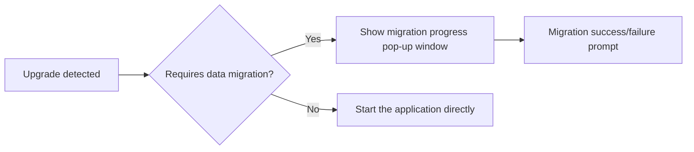

# Hongmeng Application Upgrade: 3 Key Points of Data Migration📦

When upgrading Hongmeng application or upgrading device system, data migration is the core of ensuring user experience.This article will guide you to master core components and practical skills to ensure seamless data transition~


## 1. Core scenarios and frameworks for data migration🔄
### Two major migration scenarios
1. **Application version upgrade**
- Old version (1.0) → New version (2.0)
- Scenario: database field changes, file storage path adjustment

2. **System version upgrade**
   - HarmonyOS 3 → HarmonyOS Next  
- Scenario: Application sandbox directory structure changes, data encryption policy upgrade

### Framework Core Components
| Component Name | Function |
|------------------------|---------------------------------------|  
| **BackupExtensionAbility** | Implement backup/restore logic, rewrite `onBackup`/`onRestore` |
| Backup and restore directory | Store temporary backup data (`/data/.backup/restore/`) |
| Version number verification | Determine migration type through `BundleVersion` (cross-system/in-app) |


## 2. BackupExtensionAbility Practical Battle🚀
### Core method analysis
```typescript  
export default class DataMigrationAbility extends BackupExtensionAbility {  
// Backup old data (triggered before application uninstallation or upgrade)
  async onBackup() {  
// 1. Compress the old database
    await compressFile('old_data.db', 'backup.tar.gz');  
// 2. Encrypt sensitive files
    await encryptFile('user_config.json', 'encrypted_key');  
  }  

// Recover data (triggered after application reinstallation or system upgrade)
  async onRestore(targetVersion: BundleVersion) {  
// Determine whether it is a cross-system upgrade (such as migrating from HarmonyOS 3)
    if (isLegacyVersion(targetVersion)) {  
await migrateLegacyData(); // Old format to new format
    }  
// In-app upgrade (such as 1.0→2.0)
    else {  
await updateDatabaseSchema(); // Database table structure upgrade
    }  
  }  
}  
```  

### Version compatibility logic
```typescript  
function isLegacyVersion(version: BundleVersion) {  
// HarmonyOS 3 version number starts with "3." and Next starts with "4."
  return version.name.startsWith('3.');  
}  

async function migrateLegacyData() {  
// Example: Migrate external storage data from the APK era to HarmonyOS sandbox
  const legacyPath = '/sdcard/app_data/';  
  const newPath = getAppSandboxPath('data/');  
  await copyDir(legacyPath, newPath);  
await deleteLegacyFiles(legacyPath); // Clean old data
}  
```  


## 3. Guide to migration optimization and pit avoidance⚠️
### 1. Data verification and rollback
```typescript  
async function onRestore(targetVersion) {  
  try {  
await validateBackupIntegrity(); // Verify backup file MD5
    await performMigration();  
  } catch (error) {  
    if (isCriticalError(error)) {  
await rollbackToPreviousVersion(); // Roll back to previous version data
showToast('Migration failed, old data has been restored');
    }  
  }  
}  
```  

### 2. Migrate large files in chunks
```typescript  
async function copyLargeFile(src, dest) {  
const chunkSize = 1024 * 1024; // 1MB chunking
  const fileStream = fs.createReadStream(src);  
  const writeStream = fs.createWriteStream(dest);  

  let chunk = await fileStream.read(chunkSize);  
  while (chunk) {  
    await writeStream.write(chunk);  
    chunk = await fileStream.read(chunkSize);  
updateMigrationProgress(); // Update migration progress bar
  }  
}  
```  

### 3. Sensitive data processing
```typescript  
// Encryption during backup
import { crypto } from '@ohos.security';  

async function encryptBeforeBackup(dataPath) {  
  const key = await crypto.generateKey('AES-256');  
  await crypto.encryptFile(dataPath, key, 'encrypted_backup.dat');  
// Only encrypted files are stored
  return 'encrypted_backup.dat';  
}  

// Decryption during recovery
async function decryptOnRestore(encryptedPath) {  
const key = await getDecryptionKey(); // Get the key from secure storage
  return await crypto.decryptFile(encryptedPath, key);  
}  
```  


## 4. Testing and user experience optimization📱
### 1. Simulate migration test
```bash  
# Use Hongmeng debugging tools to simulate cross-system upgrades
hdc shell bmgr backup com.example.app  
hdc shell bmgr restore com.example.app  
```  

### 2. User Guide Process


### 3. Progress feedback implementation
```typescript  
// Listen to migration progress in Ability
BackupExtensionAbility.on('progressUpdate', (percent) => {  
setMigrationProgress(percent); // Update the UI progress bar
  if (percent === 100) {  
    showSuccessToast();  
    launchApp();  
  }  
});  
```  


## Summary: The "three guarantees" principle of migration
1. **Ensure the complete data**: Block migration + verification mechanism to prevent file corruption
2. **Ensure security and compliance**: Sensitive data are encrypted throughout the process and follow privacy regulations
3. ** Ensure smooth experience**: Real-time progress prompt + failed rollback to reduce user waiting anxiety
