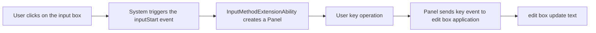

# Hongmeng Input Method Development: IME Kit Core Capabilities and Practical Guide 🖥️

Hongmeng IME Kit makes input method development "with rules to follow".This article will analyze the input method life cycle, window construction and switching logic, and attach code samples to help you get started quickly~


## 1. IME Kit Basics: "Communication Bridge" of Input Method📡
### Core Components and Responsibilities
| Component Name | Function |
|-------------------------|----------------------------------------------------------------------|  
| **InputMethodExtensionAbility** | Main service of input method, manage life cycle (create/destroy windows, listen to events) |
| **InputMethodManager** | System input method management interface (get input method list, switch input method) |
| **Panel** | Soft keyboard window container, hosting ArkUI components (keys, candidate word bars, etc.) |

### Communication process diagram



## 2. The entire development process: from environment to function implementation🚀
### 1. Key points of environment configuration
#### (1) Create a project
- Template selection: `Input Method` > `InputMethodExtensionAbility`
- Automatically generate files:
- `InputMethodService.ts`: Master Service Logic
- `keyboard_panel.ets`: keyboard interface layout

#### (2) Permission Statement
```json  
// module.json5  
{  
  "reqPermissions": [  
    { "name": "ohos.permission.GET_INPUT_METHOD" },  
    { "name": "ohos.permission.SET_INPUT_METHOD" }  
  ]  
}  
```  

### 2. Input method life cycle management
#### (1) onCreate() Initialization
```typescript  
export default class InputMethodService extends InputMethodExtensionAbility {  
  private panel: Panel | null = null;  

  onCreate(want: Want) {  
    super.onCreate(want);  
this.initPanel(); // Initialize the keyboard window
this.registerEvents(); // Register event listening
  }  

  private initPanel() {  
    this.panel = this.inputMethodAbility.createPanel((container) => {  
// Build keyboard layout using ArkUI
      Column() {  
        Grid() {  
// Number keyboard buttons
          ForEach(keyboardKeys, (key) => {  
            Button(key.label)  
              .width(50)  
              .height(50)  
              .onClick(() => this.handleKeyPress(key.value));  
          }, (key) => key.value.toString())  
        }  
      }.width('100%').height('150px');  
    });  
  }  

  private registerEvents() {  
    this.inputMethodAbility.on('inputStart', () => {  
this.panel?.show(); // Display the keyboard when the input box is focused
    });  

    this.inputMethodAbility.on('inputStop', () => {  
this.panel?.hide(); // Hide the keyboard when the input box is out of focus
    });  
  }  
}  
```  

#### (2) onDestroy() Resource Release
```typescript  
onDestroy() {  
this.panel?.destroy(); // Destroy the window
this.inputMethodAbility.off('inputStart'); // Remove event listening
  this.inputMethodAbility.off('inputStop');  
}  
```  


## 3. Core function implementation: From key press to text input🔤
### 1. Key response and text insertion
```typescript  
private handleKeyPress(key: string) {  
  switch (key) {  
    case 'Backspace':  
this.inputMethodAbility.deleteSurroundingText(1, 0); // Delete the first 1 character of the cursor
      break;  
    case 'Enter':  
this.inputMethodAbility.commitText('\n', 1); // Insert line break
      break;  
    default:  
this.inputMethodAbility.commitText(key, 1); // Insert normal characters
  }  
}  
```  

### 2. Candidate word column implementation (with layout code)
```typescript  
// keyboard_panel.ets  
Column() {  
// Keyboard body
Grid() { /* key layout */ }

// Candidate word column
  Row() {  
    ForEach(candidateWords, (word) => {  
      Text(word)  
        .margin(5)  
        .padding(8)  
        .backgroundColor('#F0F0F0')  
        .onClick(() => this.commitCandidate(word));  
    })  
  }.height(40).width('100%');  
}  

private commitCandidate(word: string) {  
this.inputMethodAbility.commitText(word, word.length); // Submit candidate words
}  
```  


## 4. Input method switching: system-level interactive implementation🔄
### 1. Get the input method list
```typescript  
import { inputMethod } from '@ohos.ime';  

async function getInstalledImes() {  
const imes = await inputMethod.getSetting().getInputMethods(true); // true=Contains enabled
  return imes.map(ime => ({  
    name: ime.displayName,  
    packageName: ime.packageName  
  }));  
}  
```  

### 2. Switch logic (Example: Switch to the system default input method)
```typescript  
async function switchToDefaultIme() {  
  const imes = await getInstalledImes();  
  const defaultIme = imes.find(ime => ime.packageName === 'com.ohos.inputmethod');  

  if (defaultIme) {  
    try {  
      await inputMethod.switchInputMethod(defaultIme.packageName);  
console.log('Switch successfully');
    } catch (error) {  
console.error('Switch failed:', error.message);
    }  
  }  
}  
```  

### 3. Listen to the current input method changes
```typescript  
inputMethod.on('currentInputMethodChanged', (newIme) => {  
console.log('Current input method:', newIme.displayName);
  if (newIme.packageName === this.context.bundleName) {  
// Logic when activate custom input method
  }  
});  
```  


## 5. Practical optimization: Make the input method more "smart"✨
### 1. Keyboard height adaptability
```typescript  
// Get screen height when Panel creation
private initPanel() {  
  const windowHeight = this.context.resourceManager.getDeviceCapability().screenHeight;  
  this.panel = this.inputMethodAbility.createPanel((container) => {  
Column().height(windowHeight * 0.2); // accounts for 20% of the screen height
  });  
}  
```  

### 2. Physical keyboard compatibility
```typescript  
this.inputMethodAbility.on('keyEvent', (event) => {  
  if (event.physicalKey) {  
// Handle physical keyboard keys (such as Ctrl+Shift switching input method)
    if (event.keyCode === 50 && event.ctrlKey) { // Ctrl+Shift  
      this.switchToNextIme();  
    }  
  }  
});  
```  

### 3. Performance optimization skills
| Scenario | Optimization Solution |
|--------------------|-------------------------------------------|  
| Key stutter | Use `LazyForEach` to delay loading non-visible keys |
| Memory Leak | Strictly unbind all event listening in `onDestroy` |
| Multilingual Switching Delay | Preload keyboard layout data for different languages ​​|


## 6. Preparation for launch: System integration and testing📱
### 1. Configure input method properties
```json  
// module.json5  
{  
  "extensionAbilities": [  
    {  
      "name": ".InputMethodService",  
      "type": "input_method",  
      "inputMethod": {  
        "description": "My Custom IME",  
        "icon": "$media:ime_icon",  
        "language": "zh_CN",  
        "inputType": ["text", "number"]  
      }  
    }  
  ]  
}  
```  

### 2. User Guide Process
```mermaid  
graph LR  
A[Application is started for the first time] --> B[Detection input method is not enabled]
B --> C [Jump system settings page]
C --> D [user manually enables input method]
D --> E[Return to the application, activate the input method]
```  

### 3. Test points
- **Compatibility**: Test keyboard layout on different resolution devices (mobile phone/tablet)
- **Stability**: Continuous input of 1000+ characters to test memory usage
- **Switch logic**: Quick switch input method 100 times to test response speed


## Summary: The "Four Elements" of Input Method Development
1. **Life Cycle**: `onCreate` initialization window, `onDestroy` completely releases resources
2. **Event-driven**: Use `inputStart/Stop` to control the keyboard to display and implicitly, and `keyEvent` to process input
3. **Interface construction**: Use ArkUI to implement responsive keyboard layout and adapt to multiple devices
4. **System integration**: Correctly configure the input method attributes to guide users to complete the activation process
