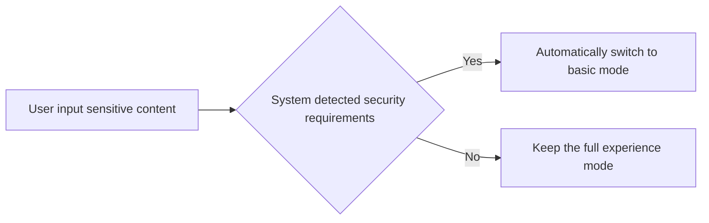

#Hongmeng Input Method Safety Mode: Core Points of Dual Mode Development🔒

In developing input methods in Hongmeng, both security and functional integrity must be taken into account.This article analyzes the differences between the basic mode and the complete experience mode, and teaches you to choose the appropriate solution based on the scene~


## 1. Security mode core: "double switch" for privacy protection🚪
### Comparison table of two modes
| Dimensions | Basic Mode (BASIC) | Complete Experience Mode (FULL) |
|---------------|----------------------------------|----------------------------------|  
| **Permission range** | Only basic input functions are allowed (key/text insertion) | Can call sensitive permissions such as network, microphone, and positioning |
| **Applicable scenarios** | Security scenarios such as financial payment, password input | Rich functional scenarios such as voice input, cloud thesaurus synchronization |
| **User Perception** | The interface displays the "Safety Input" logo | No special logo |
| **Compliance** | Comply with financial-grade privacy protection standards | Need to pass personal information protection certification |

### System-level control logic



## 2. Basic mode development: Functional adaptation in "internet disconnection" environment🤫
### 1. Core limitations and alternatives
| Restricted Features | Alternatives |
|------------------|-------------------------------------------|  
| Network Request | Use local thesaurus (pre-download common vocabulary) |
| Microphone access | Hide voice input button |
| Clipboard reading | Automatic filling is prohibited (user needs to paste manually) |
| Third-party service calls | Remove cloud-based associations, expression recommendations and other network-dependent functions |

### 2. Interface adjustment example
```typescript  
// Dynamic display of buttons according to safety mode
if (securityMode === 'BASIC') {  
  Column() {  
Text('Safe Input Mode')
      .fontSize(12)  
      .color('#666');  
// Only basic keys (letters/numbers) are displayed
Grid() { /* Basic keyboard layout */ }
  }  
} else {  
// Show full functions (voice keys/expression keys)
  Row() {  
Button('voice input').onClick(startVoiceInput);
Button('expression').onClick(showEmojiPanel);
  }  
}  
```  

### 3. Data localization storage
```typescript  
// Use local database in basic mode
import localStorage from '@ohos.data.localStorage';  

const secureStorage = localStorage.createStorage('secure_input.db', {  
encrypt: true // Sensitive data encryption storage
});  

//Storing input history (only for basic mode)
async saveInputHistory(text: string) {  
  await secureStorage.put('history', text);  
}  
```  


## 3. Complete experience mode development: "balance technique" of permissions and privacy 🧮
### 1. Sensitive permission application process
```typescript  
// Apply for microphone permissions (voice input scenario)
async requestMicrophonePermission() {  
  const result = await featureAbility.requestPermissionsFromUser([  
    'ohos.permission.RECORD_AUDIO'  
  ]);  
  if (result[0].granted) {  
    startVoiceRecognition();  
  } else {  
showToast('Please allow microphone permissions in settings');
  }  
}  
```  

### 2. Data compliance processing
| Scenarios | Compliance Measures |
|--------------------|-------------------------------------------|  
| Cloud thesaurus synchronization | Anonymous user input data (replace with random ID) |
| Voice recognition | Local processing is preferred, encrypted transmission when uploading |
| User habit analysis | Obtain express consent of the user and provide a data deletion interface |

### 3. Key points of security audit
- **Permission minimization**: Apply only if needed, and release it after use
- **Data encryption**: Sensitive data (such as account name) is encrypted to store/transfer
- **Log desensitization**: Avoid recording of complete input content, only necessary debugging information is retained


## 4. Mode switching: the "dual mechanism" between user's own and system automatic 🔄
### 1. User switches manually
```typescript  
// Provide mode switching button
Button(`Switch to ${currentMode === 'BASIC'? 'Full Mode': 'Safe Mode'}`)
  .onClick(async () => {  
    const newMode = currentMode === 'BASIC' ?  
      inputMethod.SecurityMode.FULL :  
      inputMethod.SecurityMode.BASIC;  
    await inputMethod.setSecurityMode(newMode);  
updateKeyboardLayout(newMode); // Re-render the interface
  });  
```  

### 2. Automatic system switch (triggered in sensitive scenarios)
```typescript  
// Automatically switch when the keyword "payment" is entered
inputController.on('insertText', (text) => {  
if (text.includes('pay') || text.includes('password')) {
    inputMethod.setSecurityMode(inputMethod.SecurityMode.BASIC);  
  }  
});  
```  


## 5. Practical testing: "offensive and defense drill" in safe mode🛡️
### 1. Permission Leak Test
| Test Cases | Expected Results |
|------------------------|-----------------------------------|  
| Call the network API in basic mode | Throw permission rejection exception |
| Full experience mode off permission | Function downgrade to basic mode logic |
| Data cleaning when switching mode | Sensitive temporary data (such as voice cache) is deleted |

### 2. Privacy Compliance Verification
- Use Hongmeng Privacy Detection Tool to scan the application
- Ensure that the User Privacy Agreement clearly states the differences in patterns and data usage
- Provide an independent permission management portal (settings → input method → ​​permissions)


## Summary: The "Three Principles" of Safety Model Development
1. **Mode priority**: Sensitive scenarios force the use of basic mode, and the default complete mode for ordinary scenarios
2. **Permission convergence**: Apply for permissions on demand in full experience mode to avoid "package authorization"
3. **User controllable**: Clear display of mode differences, providing convenient switching entrances and instructions
