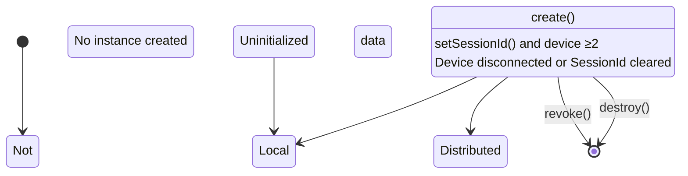

# Hongmeng distributed data synchronization: object life cycle and synchronization mechanism analysis📱💻

Hongmeng’s distributed data object synchronization makes multi-device data collaboration "feel-free".This article analyzes life cycle status, synchronization process and performance optimization, and attaches a complete code example~


## 1. Life cycle: the "state journey" of the data object🚦
### Four-state conversion diagram


### Key status description
| Status | Features | Typical Operations |
|---------------|---------------------------------------|-----------------------------------|  
| **Uninitialized** | No memory/disk data | Call `create()` to create an instance |
| **Local data object**| Local storage is only, out of sync | Call `setSessionId()` to prepare for networking |
| **Distributed data object**| In cross-device synchronization, attribute change triggers synchronization | Modify attributes and listen for `change` events |
| **Destroyed** | Memory release, disk data clear | Call `destroy()` to release resources |


## 2. Synchronization mechanism: "Invisible Pipeline" for Data Flow🔄
### Core process disassembly
1. **Initialize**
   ```javascript  
// Create an object and bind the context
   const dataObj = distributedDataObject.create(this.context, {  
title: 'Document title',
content: 'Initial content'
   });  
   ```  

2. **Network configuration**
   ```javascript  
// Set the same SessionId to join the synchronization group
dataObj.setSessionId('team collaboration-001');
   ```  

3. **Data change triggers synchronization**
   ```javascript  
// Modify properties to automatically trigger cross-device synchronization
dataObj.content = 'Updated content'; // Trigger PUT operation
   ```  

4. **Async notifications and persistence**
   ```javascript  
// Listen to change (triggered when other devices are modified)
   dataObj.on('change', (sessionId, fields) => {  
console.log(`field ${fields} has been synchronized`);
this.dataObj.save(); // Automatically persist to local database
   });  
   ```  


## 3. Performance optimization: Make synchronization more "lightweight and efficient" ⚡
### 1. Minimum granularity synchronization
```javascript  
// Only synchronize the changed properties (avoid full transmission)
dataObj.title = 'New title'; // Synchronize only title fields
```  

### 2. Compression and verification
```javascript  
// The system automatically compresses binary data (such as pictures)
dataObj.bindAssetStore('image.png', {  
  data: imageBuffer,  
compress: true // Enable compression (on by default)
});  
```  

### 3. Offline caching policy
```javascript  
// The device is temporarily stored and changed when offline, and will be automatically reissued after being connected to the network
dataObj.enableOfflineCache(true);  
dataObj.content = 'Offline modification of content'; // Storing it locally, synchronizing after networking
```  


## 4. Complete code: realize cross-device notes synchronization 📒
### 1. Creation and configuration
```javascript  
import { distributedDataObject } from '@ohos.ark.data';  

export class NoteSync {  
  private dataObj: DistributedDataObject;  

  constructor(context: Context, sessionId: string) {  
// Initialize the data object (including default value)
    this.dataObj = distributedDataObject.create(context, {  
noteTitle: 'Default title',
noteContent: 'Start editing...',
      lastUpdate: new Date().getTime()  
    });  
this.dataObj.setSessionId(sessionId); // Join the synchronization group
    this.initListener();  
  }  
}  
```  

### 2. Data changes and monitoring
```javascript  
// Modify the notes
updateNote(title: string, content: string) {  
  this.dataObj.noteTitle = title;  
  this.dataObj.noteContent = content;  
this.dataObj.lastUpdate = Date.now(); // Trigger synchronization
}  

// Listen to synchronization events
private initListener() {  
// Cross-device change notification
  this.dataObj.on('change', (sessionId, fields) => {  
    if (fields.includes('noteContent')) {  
this.onContentUpdated(); // Update local UI
    }  
  });  

// Network status changes
  this.dataObj.on('status', (sessionId, networkId, status) => {  
    if (status === 'OFFLINE') {  
showToast('The device is offline, the change will be temporarily saved');
    }  
  });  
}  
```  

### 3. Equipment Management and Destruction
```javascript  
// Remove the specified device synchronization permissions
revokeDevice(deviceId: string) {  
this.dataObj.revoke(deviceId); // Stop syncing to this device
}  

// Free up resources
destroy() {  
this.dataObj.destroy(); // Clear memory and local storage
}  
```  


## 5. Best Practice: Guide to Avoiding "Pocket Points" ⚠️
### 1. SessionId Management
- ❌ The same SessionId is used in the out-of-sync scenario (causing data confusion)
- ✅ Generate unique SessionId by business grouping (such as `Project ID-Device Type`)

### 2. Data consistency
```javascript  
// Conflict resolution: the latest update time shall prevail
dataObj.on('conflict', (oldData, newData) => {  
  return newData.lastUpdate > oldData.lastUpdate ? newData : oldData;  
});  
```  

### 3. Permission Control
```javascript  
// Limit only specific devices to write
dataObj.setAccessControlList([  
  { deviceId: 'device-001', permission: 'WRITE' },  
{ deviceId: '*', permission: 'READ' } // Other devices only read
]);  
```  


## Summary: The "three elements" of synchronous development
1. **State awareness**: Define the life cycle of the object and avoid invalid operation states
2. **Minimum change**: Only synchronize necessary fields to reduce network transmission and resource consumption
3. **Fault-tolerant design**: Handle border scenarios such as offline caching, conflict resolution, and permission control
