# Full analysis of Hongmeng Next user authentication system: the way to balance safety and experience🔒

Hongmeng Next's user authentication system builds the cornerstone of ecological security with "multi-mode authentication + security reinforcement".This article streamlines the analysis of core methods, processes and practical optimizations to help developers quickly implement security solutions~


## 1. Authentication method: "Security Matrix" from basics to biometrics
### 1. Traditional password authentication
- **Application Scenario**: Basic login (such as social, tool applications)
- **Safety Enhancement**:
- Forced password complexity (8-bit + mixed characters)
- Add salt hash storage (SHA-256+random salt value)
- Login failed to lock (5 error locks for 15 minutes)

### 2. Biometric authentication
| Type | Technical Features | Scene Adaptation |
|------------|-----------------------------------|-------------------------|  
| **Fingerprint** | Capacitive/optical acquisition, local encryption comparison | Payment verification, device unlocking |
| **Face** | 3D structured light modeling, resisting two-dimensional attacks | Quick unlocking, identity verification |
| **Iris** | Texture uniqueness, financial-grade security | Confidential systems, high-end transactions |

**Code example: Fingerprint authentication call**
```typescript  
import { biometrics } from '@ohos.biometrics';  

async function verifyFingerprint() {  
const authResult = await biometrics.verify('Fingerprint Verification', {
    type: biometrics.BiometricType.FINGERPRINT  
  });  
  return authResult.success;  
}  
```  


## 2. Authentication process: "Security Link" from request to authorization
### 1. Three-stage authentication model

```mermaid  
graph LR  
A[User Trigger Authentication] --> B{Authentication Type}
B -->|Password|C[Hash comparison + salt verification]
B -->|Biometrics|D[Feature Extraction → Safe Area Comparison]
C --> E[Generate authentication token]
D --> E  
E --> F[Permission Verification → Resource Access]
```  


### 2. Key technical points
- **Password transmission encryption**: HTTPS+TLS 1.3 transmission to prevent man-in-the-middle attacks
- **Biometric Isolated Storage**: The template is stored in TrustZone secure environment, and the application does not have direct access permissions
- **Token Aging Control**: Set short time (such as 30 minutes) + refresh mechanism to reduce the risk of token leakage


## 3. Practical optimization: "balance technique" of safety and experience
### 1. Multi-factor Certification (MFA) Combination Solution
```typescript  
// Password + fingerprint dual authentication
async function enhancedLogin(username, password, fingerprint) {  
  const pwdValid = await checkPassword(username, password);  
  const fpValid = await verifyFingerprint(fingerprint);  
  return pwdValid && fpValid;  
}  
```  

### 2. Dynamic security policy
| Scenarios | Security Policy |
|---------------------|-------------------------------------------|  
| Commonly used device login | Allow "Remember Password" + 7-day authentication-free |
| Very use device login | Forced secondary authentication (SMS/mail verification code) |
| Sensitive operations (such as transfers) | Temporary triggering biometric characteristics review |

### 3. Experience optimization skills
- **Certification Preload**: Preheat the biometric sensor when the application starts, shorten the authentication response time
- **Progressive authentication**: Normal operations use fingerprints, sensitive operations are upgraded to iris/passwords
- **Error Friendly Tips**:
  ```typescript  
  catch (error) {  
    if (error.code === 'BIOMETRIC_FAILED') {  
showToast('Fingerprint matching failed, please try again');
    } else if (error.code === 'PASSWORD_EXPIRED') {  
showToast('Password has expired, please modify it immediately');
    }  
  }  
  ```  


## 4. Security reinforcement: "Defense System" in offensive and defensive scenarios
### 1. Anti-Brute Force Crack
- Login interface current limit: IP level up to 5 requests per minute
- Behavior verification code: The graphical verification code is triggered after 3 consecutive failures

### 2. Anti-counterfeiting of biometric features
- Live test: Blinking/shaking head movement is required during facial certification
- Hardware binding: Fingerprint template is bound to device UUID, prohibiting cross-device use

### 3. Data Breach Protection
- Authentication log desensitization: storing user ID hash values, not plain text
- Security audit: Regularly scan for authentication interface vulnerabilities (such as SQL injection, XSS)


## Summary: The "Three Principles" of Certification System Design
1. **Minimum permission**: Dynamically adjust the authentication strength according to the operation sensitivity level
2. **Privacy priority**: Biometric data "local processing + irreversible encryption"
3. **Elastic Experience**: Dynamic balance between the bottom line of safety and user convenience
