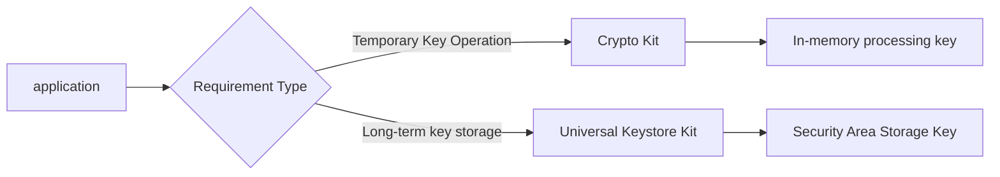
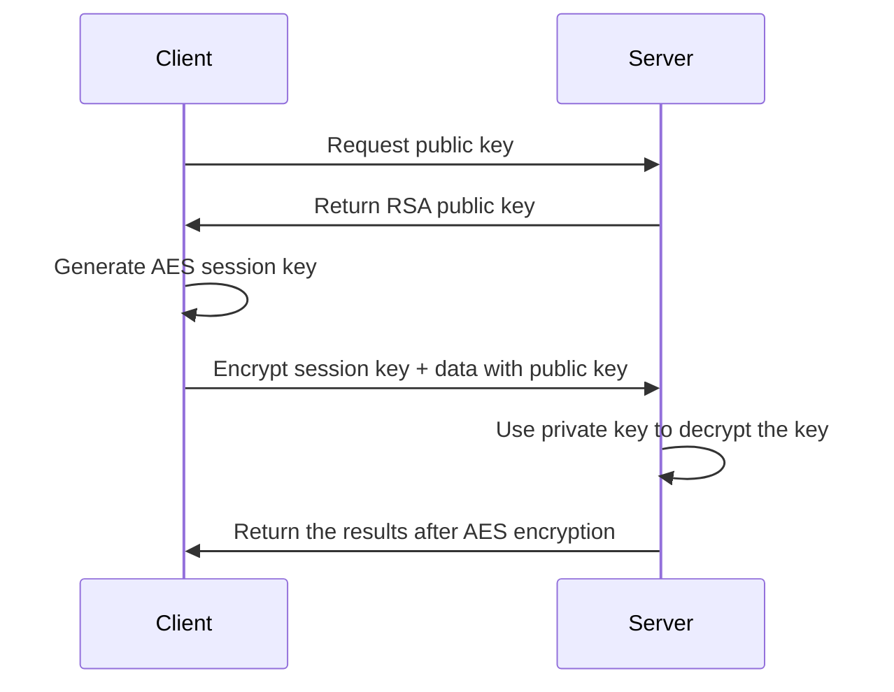

# Getting started with the Hongmeng Next Encryption and Decryption Algorithm Framework: Analysis of Security Cornerstone 🔐

Hongmeng Next's encryption and decryption framework (Crypto Architecture Kit) provides underlying support for applications to build security lines.This article analyzes the core concepts, functional characteristics and scenario adaptation to help developers get started quickly~


## 1. Frame positioning: "Swiss Army Knife" of the cryptography tool set
### Core capability matrix
| Functional module | Support algorithm/operation | Typical scenarios |
|----------------|-----------------------------------------|---------------------------|  
| **Symmetric Encryption** | AES-128/256, DES, 3DES | Chat Message Encryption, File Storage |
| **Asymmetric encryption** | RSA-2048/4096, ECDSA (P-256 curve) | Digital signature, key exchange |
| **Hash Algorithm** | SHA-256/512, MD5 (high security scenarios are not recommended) | Data integrity verification, password storage |
| **Key Derivation** | PBKDF2, Scrypt | Generate strong keys from passwords |
| **Safe Random Number** | True Random Number Generation (TRNG) | Initialization Vector (IV) Generation |

### Collaboration with key management services



## 2. Core concept: "Dual-track logic" of symmetric and asymmetric encryption
### 1. Symmetric encryption: an efficient "data safe"
- **Principle**: Encryption and decryption use the same key (such as AES's 256-bit key)
- ** Advantages**: Fast speed (AES-256 encryption speed is about 300MB/s), suitable for large file processing
- **Risk Point**: Key transmission requires a secure channel (such as passing symmetric keys through asymmetric encryption)

**Code Example: AES-CBC Encryption**
```typescript  
import { symmetric } from '@ohos.security.crypto';  

async function aesEncrypt(plaintext: string, key: string) {  
  const cipher = symmetric.createCipher('AES/CBC/PKCS7Padding');  
await cipher.init(symmetric.CipherMode.ENCRYPT, key, 'random IV value');
  return cipher.doFinal(plaintext);  
}  
```  

### 2. Asymmetric encryption: a secure "digital envelope"
- **Principle**: Public key encryption → Private key decryption (such as RSA is used to transmit symmetric keys)
- **Typical Process**:
  ```  
Sender: Encrypt data with the receiver's public key → Transmit ciphertext
Receiver: Use the private key to decrypt the cipher text → obtain the original data
  ```  
- **Performance Bottleneck**: RSA-2048 encryption speed is about 1000 times/second, not suitable for large data volume

**Code example: RSA signature verification**
```typescript  
import { asymmetric } from '@ohos.security.crypto';  

// Generate key pair
const { publicKey, privateKey } = await asymmetric.generateKeyPair('RSA', 2048);  

// sign
const signature = await asymmetric.sign(privateKey, 'data original text', 'SHA256withRSA');

// Verify the visa
const isValid = await asymmetric.verify(publicKey, 'data original text', signature, 'SHA256withRSA');
```  


## 3. Key constraints and best practices
### 1. Framework restrictions avoidance
- **Single-threaded operation**: Avoid sharing encrypted instances in multi-threaded
  ```typescript  
// Error demonstration: Multi-threading share the same cipher object
  const cipher = symmetric.createCipher('AES');  
thread1.run(() => cipher.doFinal(data1)); // May cause thread safety issues
  ```  
- **Algorithm selection principle**:
| Scenario | Recommended Algorithm | Avoid Algorithm |
  |---------------------|-------------------------|----------------|  
| High-Safe Transmission | AES-256+SHA-512 | MD5, DES |
| Digital Signature | ECDSA (P-256) | RSA-1024 |
| Password storage | PBKDF2+SHA-256 | Plaintext storage |

### 2. The Golden Rules of Key Management
- **Minimum exposure**: The key does not appear in plain text in log/network transmission
- **Tiered Storage**:
- Temporary key: generated and used in memory, destroyed immediately after the operation is completed
  ```typescript  
const key = 'temporary key';
  const buffer = new Uint8Array(key.length);  
  buffer.set(key.split('').map(c => c.charCodeAt(0)));  
// Fill in zero value after use
  buffer.fill(0);  
  ```  
- Long-term key: Save into secure zones via Universal Keystore Kit


## 4. Scenario-based application: a protective chain from storage to transmission
### 1. Local data encryption (such as user privacy files)
```typescript  
// Process: Generate a random AES key → Encrypt the file → Encrypt the AES key with the user password derived key
const fileData = readFile('sensitive data.txt');
const aesKey = symmetric.generateKey('AES', 256);  
const encryptedFile = await aesEncrypt(fileData, aesKey);  

// Generate a protection key with user password
const password = 'user password';
const derivedKey = await keyDerivation.pbkdf2(password, 'salt value', 10000, 256);
const encryptedAesKey = await asymmetric.encrypt(derivedKey, aesKey);  

// Storage: Encrypted file + encrypted AES key
writeFile('encrypted.dat', encryptedFile);  
writeFile('aeskey.enc', encryptedAesKey);  
```  

### 2. Network transmission encryption (such as API interface)



## Summary: The "three realms" of encryption development
1. **Basic layer**: Correct selection of algorithms (such as replacing MD5 with SHA-256)
2. **Security layer**: Follow the principle of minimum key exposure and make good use of system-level key management
3. **Architecture Layer**: Build a "symmetric + asymmetric" hybrid encryption system to balance performance and security
