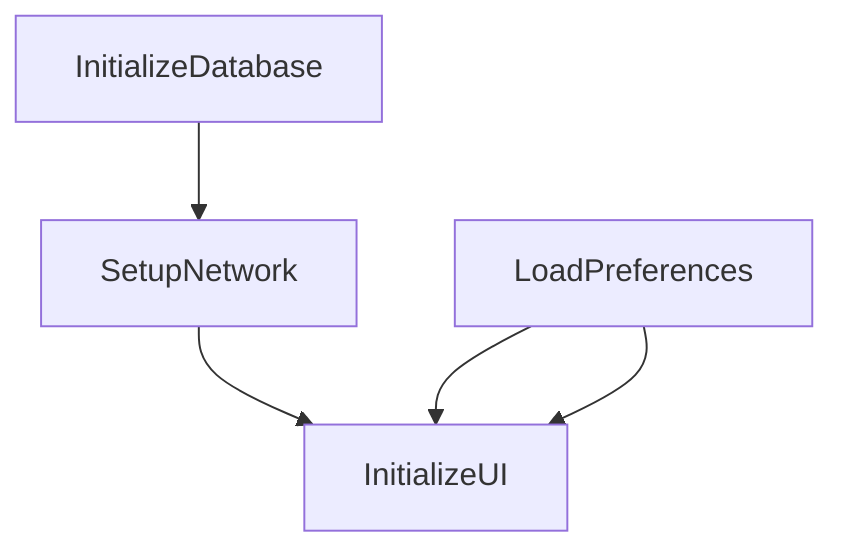

# Hongmeng Next application startup framework AppStartup: Process management and performance optimization🚀

The Hongmeng AppStartup framework makes the application startup process more efficient and controllable through task orchestration and dependency management.This article analyzes the core mechanism, configuration points and practical cases to help you optimize startup performance~


## 1. Framework positioning: "Intelligent Scheduler" for startup process
### Core Value
- **Sorting**: Ensure the order of task execution through dependency chains (such as initializing the database first and then loading the network)
- **Parallelity**: Supports parallel execution of dependency-free tasks to reduce total time-consuming
- **Configurable**: Dynamically manage tasks through JSON files without modifying code

### Typical Scenario
| Scenarios | Optimization Solutions | Revenue |
|---------------------|-----------------------------------|-----------------------|  
| Multi-module initialization | Orchestrate log, network, and database tasks by dependency | Reduce startup time by 30% |
| Asynchronous task delay loading | Non-question critical settings delay execution | Home rendering speed improvement |
| Dynamic function switch | Enable/disable startup tasks through configuration files | Flexible adaptation to different environments |


## 2. Core mechanism: "triple logic" of task scheduling
### 1. Task dependency model

- **Serial execution**: Tasks with direct dependencies (such as A→B) are executed in sequence
- **Parallel execution**: Dependless tasks (such as A and C) are started simultaneously

### 2. Start Mode Selection
| Mode | Applicable Scenarios | Code Examples |
|--------------|---------------------------|-----------------------------------|  
| **AutoStartup** | Standardized startup process | `AppStartup.getInstance().autoStartup();` |
| **Manual start** | Initialization that requires conditional triggering | `if (isFirstLaunch) appStartup.manualStartup(taskName);` |

### 3. Configuration file structure
```json  
{  
  "app_startup": [  
    {  
      "name": "TaskA",  
"dependency": ["TaskB"], // Rely on TaskB
"parallel": true, // Allows parallel to non-dependency tasks
"delay": 500, // Delay 500ms execution
"priority": 20 // Priority (the larger the value, the better the priority)
    }  
  ]  
}  
```  


## 3. Practical development: From task definition to performance tuning
### 1. Three steps in task development
#### ① Implement task interface
```java  
public class NetworkTask implements IStartupTask {  
  @Override  
  public void execute() {  
initHttpClient(); // Initialize the network client
loadConfigFromServer(); // Load remote configuration
  }  

  @Override  
  public List<String> getDependencies() {  
return Arrays.asList("DatabaseTask"); // Rely on database initialization completion
  }  
}  
```  

#### ② Register tasks and configuration
```java  
// Code registration
AppStartup.getInstance().registerTask(new NetworkTask());  

// Configuration file association
{  
  "name": "NetworkTask",  
  "dependency": ["DatabaseTask"],  
  "parallel": false,  
  "priority": 15  
}  
```  

#### ③ Trigger startup
```java  
// Automatic mode (full execution at the start of the application)
AppStartup.getInstance().autoStartup();  

// Manual mode (execution in stages)
AppStartup.getInstance().startTask("DatabaseTask");  
AppStartup.getInstance().startTask("NetworkTask");  
```  

### 2. Performance optimization skills
#### ① Parallel task splitting
```json  
[  
  { "name": "TaskA", "parallel": true },  
  { "name": "TaskB", "parallel": true },  
  { "name": "TaskC", "dependency": ["TaskA", "TaskB"] }  
]  
```  
- Effect: TaskA and TaskB are executed in parallel, and the total time is optimized from serial (Ta+Tb) to max(Ta,Tb)

#### ② Delay and priority control
```json  
[  
{ "name": "AnalyticsTask", "delay": 3000, "priority": 5 }, // Execute after 3 seconds
{ "name": "CoreServiceTask", "priority": 20 } // Highest priority
]  
```  
- Scenario: Uncertain tasks such as buried point statistics are delayed to avoid blocking core services

#### ③ Dynamic configuration management
```java  
// Load different configurations according to BuildType
if (BuildConfig.DEBUG) {  
  AppStartup.loadConfig("debug_startup.json");  
} else {  
  AppStartup.loadConfig("release_startup.json");  
}  
```  


## 4. Best practice: Avoid "start trap" ⚠️
### 1. Dependence on loop detection
- **Error configuration**:
  ```json  
  [  
    { "name": "A", "dependency": ["B"] },  
    { "name": "B", "dependency": ["A"] }  
  ]  
  ```  
- **Solution**: Automatically detect dependency rings through toolchain, prompting developers to adjust

### 2. Task timeout control
```java  
// Set the task timeout time (default 30 seconds)
AppStartupConfig config = new AppStartupConfig.Builder()  
  .setTaskName("HeavyTask")  
.setTimeout(10000) // 10 seconds timeout
  .build();  
```  

### 3. Logs and monitoring
```java  
// Global monitoring task life cycle
AppStartup.getInstance().addTaskListener(new IStartupTaskListener() {  
  @Override  
  public void onTaskStart(String taskName) {  
    Log.i("AppStartup", "Task " + taskName + " started");  
  }  

  @Override  
  public void onTaskEnd(String taskName, long duration) {  
    Log.i("AppStartup", "Task " + taskName + " ended, duration: " + duration + "ms");  
  }  
});  
```  


## 5. Typical scenario: E-commerce application startup optimization case
### Pre-optimization process (serial execution, time to 800ms)
```  
Start → Initialize the database (200ms) → Load the network configuration (300ms) → Read the local cache (200ms) → Render the first screen
```  

### Optimized process (parallel + lazy loading, time 450ms)
```mermaid  
graph TB  
A[Initialize the database (200ms)] --> C[Render the first screen (150ms)]
B[Loading Network Configuration (300ms)] --> C
D[Read local cache (200ms)] -->|Delay 100ms| C
```  

### Configuration Implementation
```json  
[  
  { "name": "DbInit", "priority": 20 },  
  { "name": "NetConfig", "dependency": ["DbInit"], "parallel": true },  
  { "name": "LocalCache", "delay": 100, "parallel": true },  
  { "name": "RenderUI", "dependency": ["DbInit", "NetConfig"] }  
]  
```  


## Summary: Start Optimization "Golden Rules"
1. **Core priority**: Ensure that the top priority is given to the top-screen rendering related tasks (such as UI initialization)
2. **Can be parallel and not serial**: Split dependency-free tasks and take advantage of multi-core CPU
3. **Delay non-essential**: Set delay or asynchronous execution of non-critical tasks such as statistics and push
4. **Dynamic adaptation**: Adjust task execution strategy according to device performance (such as low-end machines)
