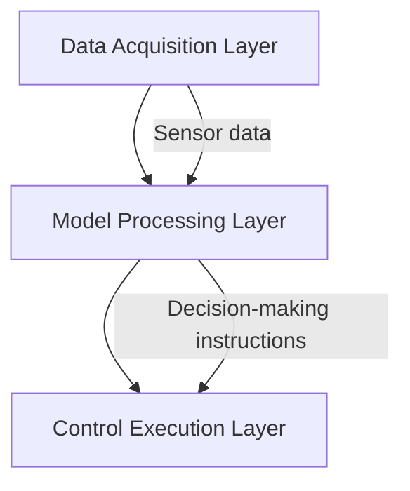

#Hongmeng Next Smart Home: Scenario implementation of lightweight models
Among the resource-constrained home devices, Hongmeng Next achieves efficient and intelligent control through lightweight model.This article analyzes the optimization solutions for device status recognition and behavior prediction, and combines practical cases to show performance improvement effects.


## 1. Demand-driven architectural design
### (I) Core scene disassembly
1. **Real-time perception of device status**
- Accurately identify the opening and closing status of light/electrical switches, doors and windows, and the response delay must be controlled within 500ms.
- Typical applications: Automatic lights in unmanned rooms, alarms are made when the refrigerator door is not closed.
2. **Active prediction of user behavior**
- Predict the equipment usage needs based on work and rest rules (pre-activate the air conditioner before work).
- Combined with the context of weather/time, etc., improve the prediction accuracy to 85%+.

### (II) Implementation of hierarchical architecture

- **Edge Computing Pre-Online**: Complete 80% of device status recognition calculations in the intelligent gateway.
- **Distributed Collaboration**: Millisecond-level communication between models and devices is realized through the Hongmeng soft bus.


## 2. Core function optimization practice
### (I) Device status recognition acceleration
| Optimization means | Technology implementation | Effect improvement |
|------------------|-----------------------------------|-------------------------|  
| **Architecture selection** | Use ShuffleNetV2 to replace ResNet | Parameters are reduced by 70% |
| **Mixed pruning** | Structured pruning (removing 30% redundant layer) + Unstructured pruning (cutting weak connections) | Accuracy is reduced by only 2%, and reasoning is speeded up by 40% |
| **Data Enhancement** | Simulate device failure status, sensor noise data | Generalization capability is improved by 8% |

### (II) Behavior prediction model iteration
```typescript  
// LSTM+context fusion example
const model = tf.sequential([  
tf.layers.lstm({ units: 64, inputShape: [30, 5] }), // 30 time steps, 5-dimensional features
  tf.layers.dense({ units: 1, activation: 'sigmoid' })  
]);  
// Fusion of time, weather and other characteristics
const contextFeatures = [hourOfDay, temperature, isWeekend];  
const inputData = tf.tensor([...historicalData, ...contextFeatures]);  
```  
- **Multi-dimensional characteristics**: Integrate 6 types of data such as time (07:00 → morning wake up), environment (28 ℃ → air conditioner probability ↑).
- **Online Learning**: Automatically update the model every 24 hours to adapt to changes in user habits.

### (III) Distributed Collaborative Strategy
1. **Dynamic scheduling of computing power**: Smart speakers process complex predictions, and smart sockets perform device status recognition.
2. **Event-driven communication**: Actively push data when the device state changes to reduce polling overhead.


## 3. Performance verification and practical experience
### (I) Comparison of quantification effects
| Indicators | Before optimization | After optimization | Improvement |
|--------------|----------|----------|----------|  
| Equipment response time | 2.2s | 0.4s | 81.8% |
| Sensor Energy Consumption | Average Daily 15mAh | 10mAh | 33.3% |
| Prediction Accuracy | 75% | 87% | 16% |

### (II) Review of typical cases
**Problem**: Communication delay of old smart light bulbs causes light control to stutter.
**solution**:
1. Deploy local cache in the gateway to store light bulb status historical data;
2. Adopt an asynchronous update mechanism and queue up instructions with low priority.

**experience**:
- 20% of the calculation redundancy is reserved to deal with equipment performance differences;
- Establish a model version rollback mechanism, and the new model grayscale release period is ≥72 hours.


## 4. Technology evolution direction
1. **Advanced AI on the end side**: Develop a lightweight inference engine based on the Hongmeng microkernel to reduce system dependence.
2. **Multimodal fusion**: Integrate camera visual data to realize extended functions such as gesture control, security monitoring, etc.
3. **Federal Learning**: On the premise of protecting privacy, we collaborate across families to improve generalization capabilities.
