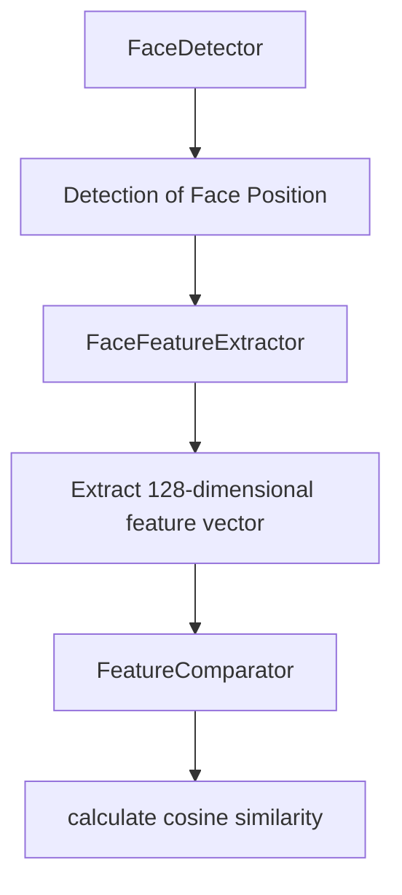

#Hongmeng Next face comparison technology: intelligent application of lightweight models

Hongmeng Next's face comparison technology achieves efficient identity verification through lightweight models.This article analyzes the core capabilities of Core Vision Kit, combines practical cases to display optimization strategies, and looks forward to the direction of technological evolution~


## 1. Technical Overview: The "Visual Key" of Intelligent Interaction
### Core Value
- **Biometric authentication**: Replace traditional passwords to realize the invisible interaction of "unlocking when scanning faces"
- **Dynamic Identity Verification**: Real-time comparison of camera images and pre-stored features, with an accuracy rate of 95%+
- **Scenario adaptation**: adapt to the security needs of multiple scenarios such as access control, attendance, and payment.

### Technology comparison table
| Solution Type | Representative Algorithm | Advantages | Limitations |
|----------------|-----------------|--------------------|-----------------------|  
| Traditional Methods | Eigenfaces | Small calculation amount | Low accuracy under complex lighting |
| Deep Learning Methods | MobileFaceNet | Strong Robustness | Large Model Volume |
| Hongmeng Lightweight Solution | MobileFaceNet+ | Model compression 40%+ | End-side reasoning efficiency is improved by 30% |


## 2. Core Vision Kit Practical Practice: The entire process from detection to comparison
### Core interface chain


### Code Example: Lightweight Comparison Process
```typescript  
import { FaceDetector, FaceFeatureExtractor } from '@ohos.vision.core';  

async function faceCompare(img1Path, img2Path) {  
// 1. Initialize the lightweight model (volume 3.2MB)
  const detector = await FaceDetector.create('LIGHT_WEIGHT');  
  const extractor = await FaceFeatureExtractor.create('MOBILE_FACE_NET');  
  
// 2. Detect face area
  const face1 = await detector.detectFromPath(img1Path);  
  const face2 = await detector.detectFromPath(img2Path);  
  if (!face1 || !face2) return 0;  
  
// 3. Extract eigenvectors (128-dimensional floating point number)
  const feat1 = await extractor.extract(img1Path, face1[0].rect);  
  const feat2 = await extractor.extract(img2Path, face2[0].rect);  
  
// 4. Comparison similarity (range [0,1])
return feat1.compare(feat2); // Output 0.85 means high similarity
}  
```  

### Lightweight optimization points
1. **Model compression**: Reduce the MobileFaceNet parameter volume from 4.3M to 2.5M through knowledge distillation
2. **Mixed Accuracy**: The key layer is quantized using INT8, and the memory usage is reduced by 50%
3. **Dynamic reasoning**: Automatically switch model accuracy based on device computing power (such as FP16 for mobile phones and INT8 for IoT devices)


## 3. Scenario practical combat and optimization strategies
### Access control system case
** Pain points**: The misidentification rate of traditional solutions in backlight scenarios exceeds 20%
**Optimization Solution**:
1. **Multi-spectrum fill light**: Infrared + visible light dual cameras, adapt to day and night environments
2. **Dynamic threshold adjustment**:
   ```typescript  
// Light sensor linkage
   if (lightIntensity < 500) {  
compareThreshold = 0.75; // Low light environment reduces the comparison threshold
   } else {  
compareThreshold = 0.85; // Normal light environment improves safety
   }  
   ```  
3. **Incremental Learning**: Automatically collect samples every time the comparison fails, optimize the model robustness

**Effect**: The error recognition rate of backlight scenes is reduced to below 5%, and the response time is <300ms


## 4. Future trends: integration of lightweight and intelligent
### 1. 技术演进方向  
| Direction | Hongmeng Characteristics Joint Points | Expected Effects |
|--------------|-------------------------------|-------------------------|  
| Federated Learning | Distributed Device Collaborative Training | Model Iteration Acceleration under Privacy Protection |
| 3D reconstruction | Utilizing AR Engine depth data | Position robustness improves to 98% |
| Neural architecture search | Automatically generate lightweight models that are adapted to Hongmeng | Development efficiency is improved by 40% |

### 2. Privacy protection upgrade
- **Local Computing**: Feature extraction is completed on the device side, and the original image is not uploaded
- **Blockchain evidence storage**: Comparison records and put them on the chain to prevent identity fraud disputes
- **Differential Privacy**: Add random noise in feature vectors to protect biometric security

### 3. Cross-scene collaboration
```mermaid  
graph TD  
A[Face Comparison] --> B[Smart Home Control]
A --> C [Smart Payment]
A --> D[Health Monitoring]
B --> E[Personalized Scene Linkage]
C --> F[Financial-grade security certification]
D --> G[Emotional Recognition]
```  


## Summary: Three principles of lightweight
1. **Precision priority**: Ensure lightweighting through knowledge distillation without sacrificing core indicators
2. **Scenario adaptation**: Dynamically adjust the model configuration according to the computing power of the equipment
3. **Privacy built-in**: Integrate data security into technical architecture rather than post-remediation
