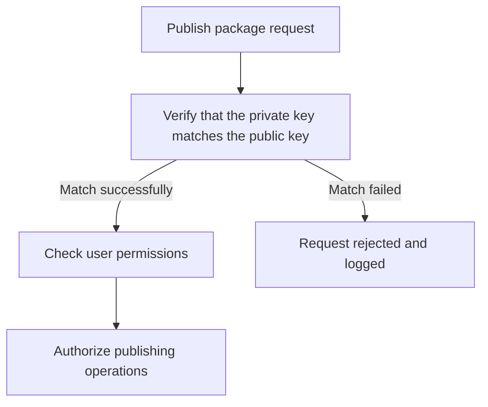

# Hongmeng Next ohpm-repo security management: permission control and protection policies

In enterprise-level Hongmeng development, the security protection of ohpm-repo private warehouses is crucial.This article provides detailed explanation of the entire process security strategy from access control, key authentication to intrusion protection, and builds a solid line of defense for code assets~


## 1. Access control: refined permission management
### 1. Repository source binding and verification
```bash  
# Bind private repository source
ohpm config set registry http://private warehouse IP:port/repos/ohpm

# Check the current warehouse configuration
ohpm config get registry  
```  

### 2. Access_token permission control
| Permission Type | Configuration Method | Applicable Scenarios |
|----------|-----------------------------------|-------------------------|  
| Read-only permissions | Assign ordinary developer tokens | Code download, dependency installation |
| Writable permissions | Generate tokens with write permissions for administrator groups | Package release, version management |

**Server configuration example** (`ohpm-repo/config.yaml`):
```yaml  
access_control:  
  - role: developer  
    permissions: read-only  
  - role: admin  
    permissions: read-write  
```  

### 3. Group-based permission assignment
```bash  
# Add user to the development group
ohpm group add-member dev-group developer1  

# View group permission map
ohpm group list-permissions dev-group  
```  


## 2. Key authentication: Anti-overrepresentation release plan
### 1. Generate encryption key pairs
```bash  
# Generate a 4096-bit RSA key pair (need to set a password)
ssh-keygen -m PEM -t RSA -b 4096 -f ~/.ssh/ohpm-key  
```  

### 2. Key binding process
1. Log in to the private warehouse management page → Personal center → Add a new public key
2. Paste `ohpm-key.pub` content to complete the binding
3. Configure the private key path on the development machine:
```bash  
ohpm config set key_path ~/.ssh/ohpm-key  
```  

### 3. Publish operation authentication logic



## 3. Security Strengthening: Transmission and Protection Strategy
### 1. HTTPS encryption transmission configuration
**ohpm-repo configuration**(`config.yaml`):
```yaml  
listen: https://private warehouse IP:8088
https_key: /ssl/server.key  
https_cert: /ssl/server.crt  
```  

**Nginx reverse proxy configuration**:
```nginx  
server {  
  listen 443 ssl;  
  ssl_certificate /path/server.crt;  
  ssl_certificate_key /path/server.key;  
  location / { proxy_pass http://ohpm-repo; }  
}  
```  

### 2. Depend on protection configuration
```yaml  
# Disable the deletion of depended packages
allow_remove_depended_packages: false  

# Enable the operation audit log
audit_log: true  
```  

### 3. Exception access detection scheme
1. Write a log analysis script (example snippet):
```python  
# Detect high-frequency abnormal IP
with open('access.log') as f:  
  ips = {}  
  for line in f:  
    ip = line.split()[0]  
    ips[ip] = ips.get(ip, 0) + 1  
  for ip, count in ips.items():  
if count > 100: # More than 100 requests per minute
      block_ip(ip)  
```  
2. Combined with the firewall to block exception IP:
```bash  
iptables -A INPUT -s Exception IP -j DROP
```  


## 4. Best practices for safe operation and maintenance
1. **Regularly rotate keys**: Force update access_token and SSH keys every quarter
2. **Minimum permission principle**: Developers only grant necessary package read and write permissions
3. **Disa recovery strategy**: Regular backup of ohpm-repo metadata and package files
